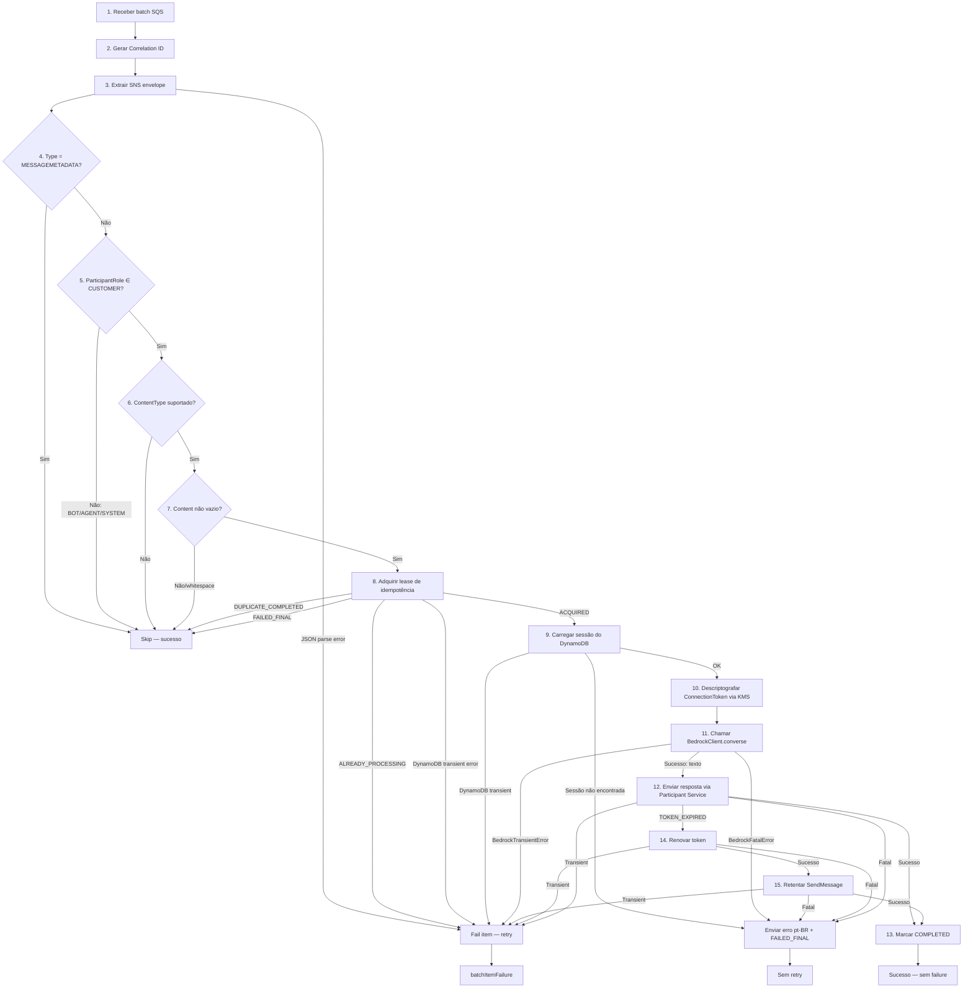

# Design Document — POC Bedrock Converse

## Overview

## 1. Visão geral

Esta POC (POC-01) substitui a camada MCP (Model Context Protocol) na integração de chat do Amazon Connect por uma integração direta com a Amazon Bedrock Converse API. O fluxo principal permanece:

**Amazon Connect Chat Widget → Contact Flow → Initializer Lambda → StartContactStreaming → SNS → SQS → Integrator Lambda → BedrockClient → Amazon Bedrock Converse API → Participant Service API → Usuário**

A POC é completamente independente da POC MCP existente. Nenhum recurso da POC MCP é alterado, destruído ou importado. Ambas as POCs coexistem com estados Terraform separados, prefixos de nome distintos e Contact Flows independentes.

O BedrockClient (`src/shared/bedrock_client/`) encapsula toda comunicação com o Bedrock Runtime, substituindo o MCPClient + MCP Server Lambda + Function URL + SigV4 da arquitetura anterior.

---

## 2. Princípios de isolamento

| Princípio | Descrição |
|-----------|-----------|
| Repositório separado (lógico) | A POC Bedrock usa seu próprio estado Terraform, sem compartilhar backend |
| Estado Terraform independente | Nenhum `terraform.tfstate` copiado da POC MCP; nenhum backend remoto compartilhado |
| Sem workspace compartilhado | O workspace Terraform é dedicado à POC Bedrock |
| Prefixo de recurso `connect-bedrock-poc` | Todos os recursos usam este prefixo em vez de `connect-mcp-poc` |
| Contact Flow separado | Cópia ou novo flow; o flow ativo da POC MCP não é tocado |
| Sem alterações em recursos MCP | Nenhum destroy, replace, import ou modify de recursos MCP |
| Plan com destroy/replace MCP rejeitado | Qualquer `terraform plan` com operação destrutiva em recurso `connect-mcp-poc` falha na revisão |
| Sem import de recursos MCP | `terraform import` de recursos da POC MCP é proibido |

---

## Architecture

## 3. Diagrama de arquitetura

```mermaid
flowchart TD
    subgraph "Frontend"
        CW[Chat Widget]
    end

    subgraph "Amazon Connect"
        CF[Contact Flow<br/>connect-bedrock-poc]
    end

    subgraph "Inicialização"
        INIT[Initializer Lambda<br/>connect-bedrock-poc-dev-initializer]
        SCS[StartContactStreaming]
    end

    subgraph "Mensageria"
        SNS[SNS Topic<br/>connect-bedrock-poc-dev-streaming]
        SQS[SQS Queue<br/>connect-bedrock-poc-dev-messages]
        DLQ[DLQ<br/>connect-bedrock-poc-dev-messages-dlq]
    end

    subgraph "Processamento"
        INT[Integrator Lambda<br/>connect-bedrock-poc-dev-integrator]
        BC[BedrockClient<br/>src/shared/bedrock_client/]
    end

    subgraph "Persistência"
        SESS[(Session DynamoDB<br/>connect-bedrock-poc-dev-sessions)]
        IDEMP[(Idempotency DynamoDB<br/>connect-bedrock-poc-dev-idempotency)]
        KMS[KMS Key<br/>connect-bedrock-poc-dev-tokens]
    end

    subgraph "IA"
        BEDROCK[Amazon Bedrock Runtime<br/>Converse API]
    end

    subgraph "Entrega"
        PS[Participant Service API<br/>SendMessage]
    end

    subgraph "Observabilidade"
        CWL[CloudWatch Logs]
    end

    %% Fluxo principal
    CW -->|WebSocket| CF
    CF -->|InvokeContactFlow| INIT
    INIT -->|StartContactStreaming| SCS
    SCS -->|Publica eventos| SNS
    SNS -->|Subscription| SQS
    SQS -->|Event Source Mapping| INT

    INT -->|1. Idempotência| IDEMP
    INT -->|2. Sessão| SESS
    INT -->|3. Decrypt token| KMS
    INT -->|4. Mensagem do usuário| BC
    BC -->|5. converse()| BEDROCK
    BEDROCK -->|6. Resposta| BC
    BC -->|7. Texto extraído| INT
    INT -->|8. SendMessage| PS
    PS -->|9. Resposta ao chat| CW

    %% Retry flow
    SQS -->|maxReceiveCount=3| DLQ
    INT -.->|batchItemFailure| SQS

    %% Observabilidade
    INT -->|Logs estruturados| CWL
    BC -->|Logs sanitizados| CWL
    INIT -->|Logs| CWL

    %% Estilos
    classDef main fill:#e1f5fe,stroke:#0288d1
    classDef retry fill:#fff3e0,stroke:#f57c00
    classDef dlq fill:#fce4ec,stroke:#c62828

    class CW,CF,INIT,SCS,SNS,SQS,INT,BC,BEDROCK,PS,SESS,IDEMP,KMS main
    class DLQ dlq
```

**Legenda de fluxos:**
- **Linha contínua (→):** Fluxo principal de processamento
- **Linha tracejada (-.->):** Fluxo de retry (batchItemFailure → SQS redelivery)
- **SQS → DLQ:** Fluxo de dead-letter após maxReceiveCount=3

---

## Components and Interfaces

## 4. Componentes preservados, removidos e adicionados

### 4.1 Preservados (replicados na nova POC com prefixo `connect-bedrock-poc`)

| Componente | Descrição |
|-----------|-----------|
| Frontend / Chat Widget | Widget de chat embarcado que conecta ao Amazon Connect |
| Initializer Lambda | Cria sessão, inicia streaming, persiste tokens criptografados |
| Event parser | Desempacota SQS → SNS → Connect event, classifica mensagens |
| SNS Topic | Recebe eventos de streaming do Amazon Connect |
| SQS Queue | Fila principal com visibility timeout 360s e long polling |
| DLQ | Dead-letter queue com retenção 14 dias, maxReceiveCount=3 |
| DynamoDB Sessions | Tabela de sessões com TTL, criptografia server-side |
| DynamoDB Idempotency | Tabela de idempotência com lease-based locking |
| KMS Key | Chave para criptografar/descriptografar tokens |
| Idempotência | Mecanismo PROCESSING/COMPLETED/FAILED_FINAL com lease 90s |
| Partial batch response | `batchItemFailures` no retorno do handler |
| Token renewal | Renovação de ConnectionToken via CreateParticipantConnection |
| Participant Service | Envio de respostas via SendMessage com ClientToken determinístico |
| Correlation ID | Identificador UUID v4 gerado ou propagado (fonte configurável) em todos os logs |

### 4.2 Não provisionados na nova POC (NÃO destruídos da POC MCP)

| Componente | Motivo da exclusão |
|-----------|-------------------|
| MCP Server Lambda | Substituído por Bedrock Converse API direta |
| MCPClient (`src/shared/mcp_client/`) | Substituído por BedrockClient |
| Lambda Function URL | Não necessária sem MCP Server |
| FastMCP / Mangum | Frameworks do MCP Server não utilizados |
| SigV4 signing para Function URL | Não necessário sem Function URL |
| MCP Server IAM Role | Sem Lambda MCP Server para executar |
| `MCP_SERVER_URL` env var | Integrator não chama MCP |
| Permissões `lambda:InvokeFunctionUrl` | Sem Function URL para invocar |

### 4.3 Adicionados

| Componente | Descrição |
|-----------|-----------|
| BedrockClient (`src/shared/bedrock_client/`) | Módulo de abstração para Converse API |
| Converse API integration | Chamada direta ao `bedrock-runtime:converse` |
| Variáveis `BEDROCK_*` | `BEDROCK_MODEL_ID`, `BEDROCK_MAX_TOKENS`, `BEDROCK_TEMPERATURE`, `BEDROCK_SYSTEM_PROMPT`, `BEDROCK_TIMEOUT_SECONDS` |
| Permissão `bedrock:InvokeModel` | IAM policy no Integrator para invocar modelos |
| Testes unitários do BedrockClient | Config, parsing, erros, timeout, sanitização |
| Smoke test Bedrock | `scripts/smoke_test_bedrock.ps1` com chamada real |

---

## 5. Estrutura de diretórios proposta

```
poc_connect_bedrock/
├── src/
│   ├── initializer/              # Lambda Initializer (preservada)
│   │   ├── __init__.py
│   │   ├── config.py
│   │   ├── exceptions.py
│   │   ├── handler.py
│   │   └── service.py
│   ├── integrator/               # Lambda Integrator (adaptada: MCP → Bedrock)
│   │   ├── __init__.py
│   │   ├── config.py             # + novas configs BEDROCK_*
│   │   ├── event_parser.py       # Preservado
│   │   ├── exceptions.py         # Preservado
│   │   ├── handler.py            # Adaptado: usa BedrockClient
│   │   ├── idempotency_repository.py  # Preservado
│   │   ├── logging_config.py     # Preservado
│   │   ├── models.py             # Preservado
│   │   ├── participant_service.py     # Preservado
│   │   ├── processor.py          # Adaptado: MCP → BedrockClient
│   │   └── session_repository.py      # Preservado
│   └── shared/
│       ├── __init__.py
│       ├── crypto.py             # Preservado (KMS)
│       └── bedrock_client/       # NOVO — módulo de abstração Bedrock
│           ├── __init__.py       # Exporta interface pública
│           ├── client.py         # BedrockClient class
│           ├── config.py         # Validação de configuração
│           ├── exceptions.py     # BedrockConfigurationError, BedrockTransientError, etc.
│           └── response_parser.py # Extração de texto da resposta Converse
├── tests/
│   ├── unit/
│   │   ├── test_bedrock_client.py
│   │   ├── test_bedrock_config.py
│   │   ├── test_bedrock_response_parser.py
│   │   ├── test_bedrock_exceptions.py
│   │   ├── test_event_parser.py       # Preservado
│   │   ├── test_processor.py          # Adaptado
│   │   └── test_log_sanitization.py
│   └── integration/
│       ├── test_integrator_bedrock_flow.py
│       ├── test_message_routing.py
│       ├── test_idempotency.py
│       └── test_correlation_id.py
├── scripts/
│   ├── build_lambdas.ps1         # Preservado
│   ├── build_lambdas.sh          # Preservado
│   └── smoke_test_bedrock.ps1    # NOVO
├── terraform/                    # Reescrito com prefixo connect-bedrock-poc
│   ├── providers.tf
│   ├── variables.tf              # + bedrock_model_id, bedrock_* vars
│   ├── locals.tf                 # Prefixo connect-bedrock-poc
│   ├── lambda.tf                 # Sem MCP Server; Integrator com BEDROCK_* vars
│   ├── iam.tf                    # Sem MCP; + bedrock:InvokeModel
│   ├── dynamodb.tf
│   ├── sqs.tf
│   ├── sns.tf
│   ├── kms.tf
│   ├── event_source.tf
│   ├── monitoring.tf
│   └── outputs.tf
├── docs/
│   ├── architecture.md
│   ├── deployment-guide.md
│   ├── testing-strategy.md
│   ├── troubleshooting.md
│   ├── security.md
│   ├── bedrock-converse-flow.md
│   ├── migration-from-mcp.md
│   ├── cost-considerations.md
│   └── known-limitations.md
└── .kiro/
    └── specs/
        └── connect-bedrock-converse-poc/
            ├── .config.kiro
            ├── requirements.md
            ├── design.md
            └── tasks.md
```

---

## 6. Design do BedrockClient

### Interface pública

```python
class BedrockClient:
    """
    Abstração para Amazon Bedrock Converse API.
    
    Responsabilidades:
    - Construir e enviar requisições à Converse API
    - Extrair texto da resposta (multi-bloco)
    - Classificar erros em transitórios/fatais
    - Registrar latência sem conteúdo sensível
    - Aplicar timeout configurável
    """

    def __init__(self, correlation_id: str | None = None) -> None:
        """
        Inicializa o cliente lendo configuração de variáveis de ambiente.
        
        Raises:
            BedrockConfigurationError: se BEDROCK_MODEL_ID não definido/vazio
                ou se valores numéricos estão fora dos limites válidos.
        """
        ...

    def converse(self, user_message: str, correlation_id: str | None = None) -> str:
        """
        Envia mensagem do usuário ao Bedrock e retorna texto da resposta.
        
        Args:
            user_message: Texto do usuário (1 a 4096 caracteres).
            correlation_id: ID de correlação para logs (opcional, sobrescreve o do init).
            
        Returns:
            Texto extraído da resposta do modelo. Fallback se sem conteúdo.
            
        Raises:
            BedrockTransientError: throttling, timeout, service unavailable.
            BedrockFatalError: access denied, validation error, erro inesperado.
            BedrockTimeoutError: chamada excedeu BEDROCK_TIMEOUT_SECONDS.
        """
        ...
```

### Detalhes de implementação

1. **Construção do cliente boto3:** `boto3.client("bedrock-runtime", region_name=AWS_REGION)` — criado uma vez na inicialização e reutilizado entre invocações (cold start vs warm start).

2. **Leitura de variáveis de ambiente:** Na inicialização (`__init__`), lê e valida:
   - `BEDROCK_MODEL_ID` (obrigatória, não vazia)
   - `BEDROCK_MAX_TOKENS` (padrão 1024, range 1–4096)
   - `BEDROCK_TEMPERATURE` (padrão 0.7, range 0.0–1.0)
   - `BEDROCK_SYSTEM_PROMPT` (padrão com instruções em português)
   - `BEDROCK_TIMEOUT_SECONDS` (padrão 20)

3. **Validação de configuração:** Se qualquer valor estiver fora do range ou for inválido, lança `BedrockConfigurationError` com mensagem descritiva.

4. **Montagem do system prompt:** Passado como `system=[{"text": system_prompt_text}]` na chamada.

5. **Montagem das messages:** `messages=[{"role": "user", "content": [{"text": user_message}]}]`

6. **inferenceConfig:** `{"maxTokens": max_tokens, "temperature": temperature}`

7. **Timeout:** Aplicado em duas camadas:
   - **botocore.config.Config:** Define `connect_timeout=5` (segundos, para estabelecer conexão TCP/TLS com Bedrock) e `read_timeout=BEDROCK_TIMEOUT_SECONDS` (controla o timeout de leitura de cada resposta HTTP individual).
   - **Verificação de tempo restante:** O BedrockClient DEVE receber `remaining_time_ms` (obtido via `context.get_remaining_time_in_millis()` no handler) e verificar ANTES de chamar Bedrock se `remaining_time_ms >= (BEDROCK_TIMEOUT_SECONDS * 1000) + 5000`. Se não houver tempo suficiente, aborta imediatamente com `BedrockTimeoutError` sem fazer a chamada HTTP.
   - **IMPORTANTE:** `botocore.config.Config(read_timeout=...)` NÃO garante um deadline total de execução — apenas controla o timeout de socket para cada resposta HTTP. A verificação do tempo restante da Lambda é o mecanismo que garante a margem operacional de 5 segundos.

8. **Parsing da resposta:** Delegado ao módulo `response_parser.py` (seção 9).

9. **Sanitização de logs:** Registra `model_id`, `latency_ms`, `correlation_id`, `error_code`. NUNCA registra conteúdo da mensagem do usuário ou resposta do modelo em NENHUM nível (incluindo DEBUG). Apenas metadados derivados (`content_length`, `response_length`) são permitidos.

10. **Classificação de erros:** Mapeia exceções boto3 para hierarquia de exceções do módulo (seção 10).

---

## Data Models

## 7. Configuração

| Variável | Tipo | Obrigatória | Padrão | Validação | Comportamento em erro |
|----------|------|-------------|--------|-----------|----------------------|
| `BEDROCK_MODEL_ID` | string | Sim | — | Não vazia | `BedrockConfigurationError` na inicialização; Lambda não processa requisições |
| `BEDROCK_MAX_TOKENS` | int | Não | `1024` | 1 ≤ valor ≤ 4096 | `BedrockConfigurationError` na inicialização |
| `BEDROCK_TEMPERATURE` | float | Não | `0.7` | 0.0 ≤ valor ≤ 1.0 | `BedrockConfigurationError` na inicialização |
| `BEDROCK_SYSTEM_PROMPT` | string | Não | Ver abaixo | Não vazia quando definida | Usa padrão se vazia/indefinida |
| `BEDROCK_TIMEOUT_SECONDS` | int | Não | `20` | 5 ≤ valor ≤ (Lambda timeout - 5) | `BedrockConfigurationError` na inicialização |
| `AWS_REGION` | string | Não | `us-east-1` | Formato válido de região AWS | Usa padrão |

### System prompt padrão

```
Você é um agente virtual de suporte. Responda sempre em português brasileiro.
Seja claro e objetivo nas respostas. Atue como agente virtual de suporte.
Não invente informações que não estejam disponíveis.
Informe ao usuário quando não tiver dados suficientes para responder.
```

### Regra de timeout

```
BEDROCK_TIMEOUT_SECONDS ≤ INTEGRATOR_TIMEOUT_SECONDS - 5
```

Com o timeout atual do Integrator de 60s, o `BEDROCK_TIMEOUT_SECONDS` máximo permitido é 55s. O padrão de 20s deixa 40s de margem para: parsing SQS (~1ms), DynamoDB reads/writes (~50-200ms), KMS decrypt (~50-100ms), Participant Service SendMessage (~200-500ms), e finalização/logging.

---

## 8. Requisição Converse API

### Estrutura conceitual

```python
response = bedrock_client.converse(
    modelId="<BEDROCK_MODEL_ID>",
    system=[
        {"text": "<BEDROCK_SYSTEM_PROMPT>"}
    ],
    messages=[
        {
            "role": "user",
            "content": [
                {"text": "<mensagem_do_usuario>"}
            ]
        }
    ],
    inferenceConfig={
        "maxTokens": 1024,   # BEDROCK_MAX_TOKENS
        "temperature": 0.7   # BEDROCK_TEMPERATURE
    }
)
```

### Exemplo com valores reais

```python
response = bedrock_client.converse(
    modelId="us.amazon.nova-lite-v1:0",
    system=[
        {"text": "Você é um agente virtual de suporte. Responda sempre em português brasileiro. Seja claro e objetivo nas respostas. Não invente informações que não estejam disponíveis. Informe ao usuário quando não tiver dados suficientes para responder."}
    ],
    messages=[
        {
            "role": "user",
            "content": [
                {"text": "Como faço para resetar minha senha?"}
            ]
        }
    ],
    inferenceConfig={
        "maxTokens": 1024,
        "temperature": 0.7
    }
)
```

### Regras de segurança

- O conteúdo de `messages[*].content[*].text` **NÃO DEVE** ser registrado em log em **NENHUM nível** (incluindo DEBUG)
- O conteúdo da resposta do modelo **NÃO DEVE** ser registrado em log em **NENHUM nível** (incluindo DEBUG)
- O conteúdo de `system[*].text` pode ser registrado em log DEBUG (não contém dados do usuário)
- O `modelId` pode ser registrado em qualquer nível
- O `inferenceConfig` pode ser registrado em qualquer nível
- Apenas metadados derivados (`content_length`, `response_length`) são permitidos para diagnóstico

---

## 9. Parsing da resposta

### Algoritmo de extração (`response_parser.py`)

```
1. Localizar output.message.content na resposta
2. SE content é None ou lista vazia → retornar FALLBACK_MESSAGE
3. Filtrar blocos que possuem chave "text"
4. Remover blocos onde text é None ou string vazia/whitespace
5. Coletar valores .text dos blocos restantes
6. SE nenhum bloco de texto válido encontrado → retornar FALLBACK_MESSAGE
7. Concatenar valores com "\n" (separador de linha única)
8. Retornar string concatenada
```

### Mensagem de fallback

```
Desculpe, não consegui gerar uma resposta. Por favor, tente reformular sua pergunta.
```

### Cenários de resposta

| Cenário | Entrada (content) | Saída |
|---------|-------------------|-------|
| Bloco único | `[{"text": "Olá!"}]` | `"Olá!"` |
| Múltiplos blocos texto | `[{"text": "Parte 1"}, {"text": "Parte 2"}]` | `"Parte 1\nParte 2"` |
| Mix texto + não-texto | `[{"text": "Info"}, {"image": {...}}, {"text": "Mais"}]` | `"Info\nMais"` |
| Content vazio | `[]` | Fallback |
| Content ausente | `None` / campo não existe | Fallback |
| Somente não-texto | `[{"image": {...}}, {"toolUse": {...}}]` | Fallback |
| Texto vazio | `[{"text": ""}, {"text": "   "}]` | Fallback |

---

## 10. Modelo de erros

### Hierarquia de exceções

```python
class BedrockError(Exception):
    """Exceção base do módulo BedrockClient."""
    def __init__(self, message: str, error_code: str | None = None):
        self.error_code = error_code
        super().__init__(message)

class BedrockConfigurationError(BedrockError):
    """Erro de configuração — variável ausente ou valor inválido."""
    pass

class BedrockTransientError(BedrockError):
    """Erro transitório — retry é apropriado."""
    pass

class BedrockFatalError(BedrockError):
    """Erro fatal — não fazer retry, marcar FAILED_FINAL."""
    pass

class BedrockTimeoutError(BedrockTransientError):
    """Timeout — subtipo de transitório, permite retry."""
    pass
```

### Mapeamento de erros AWS → Categoria → Comportamento

| Erro AWS | Categoria | Comportamento do Integrator |
|----------|-----------|----------------------------|
| ThrottlingException | `BedrockTransientError` | Fail item SQS → retry |
| ServiceUnavailableException | `BedrockTransientError` | Fail item SQS → retry |
| ModelTimeoutException | `BedrockTransientError` | Fail item SQS → retry |
| ReadTimeoutError (botocore) | `BedrockTimeoutError` | Fail item SQS → retry |
| ConnectTimeoutError (botocore) | `BedrockTimeoutError` | Fail item SQS → retry |
| AccessDeniedException | `BedrockFatalError` | Mensagem de erro pt-BR ao usuário + FAILED_FINAL |
| ValidationException | `BedrockFatalError` | Mensagem de erro pt-BR ao usuário + FAILED_FINAL |
| ModelNotFoundException | `BedrockFatalError` | Mensagem de erro pt-BR ao usuário + FAILED_FINAL |
| ClientError (outros códigos) | `BedrockFatalError` | Mensagem de erro pt-BR ao usuário + FAILED_FINAL |

### Análise de risco: FAILED_FINAL para AccessDeniedException e ValidationException

**AccessDeniedException:**
- Risco: Se for intermitente (policy propagation delay), marcar FAILED_FINAL perde a mensagem
- Mitigação: AccessDeniedException em chamadas ao Bedrock é quase sempre permanente (credenciais insuficientes, modelo não habilitado). Retry não resolve sem intervenção manual
- Decisão: FAILED_FINAL é correto. O alarme FailedFinal alertará o operador

**ValidationException:**
- Risco: Poderia ser um input específico que causa validação ruim (mensagem muito longa, caracteres inválidos)
- Mitigação: O BedrockClient já limita input a 4096 caracteres. ValidationException indica configuração incorreta (model ID inválido, parâmetros incompatíveis)
- Decisão: FAILED_FINAL é correto. Indica problema de configuração que requer intervenção

### Mensagem de erro para o usuário

Quando um erro fatal ocorre, o Integrator envia ao chat:

```
Desculpe, não consegui processar sua solicitação no momento. Por favor, tente novamente em alguns instantes.
```

(Mesma mensagem `GENERIC_ERROR_MESSAGE` já usada na POC MCP)

### Comportamento de BedrockConfigurationError no cold start

Quando o BedrockClient lança `BedrockConfigurationError` durante a inicialização (cold start) — por exemplo, `BEDROCK_MODEL_ID` ausente ou vazia:

| Aspecto | Comportamento |
|---------|---------------|
| Exceção | Não tratada pelo handler — propaga como erro fatal da Lambda |
| Batch inteiro | **FALHA TOTAL** — Lambda não retorna `batchItemFailures`; o SQS trata como falha completa |
| Todos os records do batch | Retornam à fila após `visibility_timeout` (360s) para retry |
| Após maxReceiveCount=3 | TODOS os records vão para a DLQ |
| Mensagem ao usuário | **IMPOSSÍVEL** — nenhuma sessão foi carregada, nenhum token descriptografado |
| Idempotência | **Não marcada** — nenhum `try_acquire` foi executado; records ficam "livres" |
| Natureza do erro | Erro de **deploy/configuração**, não de mensagem individual |
| Resolução | Corrigir variáveis de ambiente e redeployar a Lambda |

**Mitigação obrigatória:** O smoke test (`scripts/smoke_test_bedrock.ps1`) DEVE ser executado com sucesso ANTES de habilitar o event source mapping (SQS → Lambda). Isso valida que o BedrockClient inicializa sem erro com as variáveis configuradas. O event source mapping DEVE ser criado com `enabled = false` inicialmente e habilitado apenas após smoke test bem-sucedido.

**Sequência segura:**
1. `terraform apply` — cria Lambda com event source mapping **desabilitado**
2. Executar smoke test — valida configuração Bedrock
3. Habilitar event source mapping — `aws lambda update-event-source-mapping --uuid <id> --enabled`

---

## 11. Fluxo detalhado da Integrator



### Passos detalhados

1. **Receber batch SQS:** Handler recebe `event` com array `Records`. Valida que todos têm `messageId`.
2. **Gerar/buscar Correlation ID:** Para cada registro SQS, ANTES de qualquer parse, resolve o correlation_id seguindo a ordem de prioridade configurável (ver seção 13). Se nenhum encontrado, gera UUID v4. A partir deste ponto TODA entrada de log para este registro inclui o `correlation_id`.
3. **Extrair SNS envelope:** Parse JSON do body → envelope SNS → campo `Message` → evento Connect. Se JSON inválido ou estrutura inesperada, o erro é logado COM o correlation_id já disponível e o registro é marcado como batch item failure.
4. **Ignorar MESSAGEMETADATA:** Se `Type != "MESSAGE"`, skip sem failure.
5. **Ignorar roles não-cliente:** Se `ParticipantRole ∈ {CUSTOM_BOT, AGENT, SYSTEM}`, skip.
6. **Validar ContentType:** Se não é `text/plain` nem `text/markdown`, skip.
7. **Validar content:** Se vazio ou whitespace, skip.
8. **Adquirir lease de idempotência:** PutItem condicional com lease 90s.
9. **Carregar sessão:** GetItem consistente na tabela Sessions.
10. **Descriptografar ConnectionToken:** KMS Decrypt do blob armazenado.
11. **Chamar BedrockClient:** `bedrock_client.converse(user_message, correlation_id, remaining_time_ms)`.
12. **Enviar resposta:** `ParticipantService.send_message(connection_token, texto, ...)`.
13. **Marcar COMPLETED:** UpdateItem na tabela Idempotency.
14. **Renovar token se TOKEN_EXPIRED:** `CreateParticipantConnection` com `ParticipantToken`.
15. **Classificar falhas:** Transitórias → `batchItemFailure`. Fatais → mensagem de erro + FAILED_FINAL.

---

## 12. Idempotência

### Chave primária

```
pk = "MESSAGE#{message_id}"
```

Onde `message_id` é o campo `Id` do evento Amazon Connect (único por mensagem no chat).

### Estados

| Estado | Significado | Transições possíveis |
|--------|-------------|---------------------|
| PROCESSING | Em processamento, lease ativo | → COMPLETED, → FAILED_FINAL |
| COMPLETED | Resposta enviada com sucesso ao chat | Terminal |
| FAILED_FINAL | Erro permanente, sem retry | Terminal |

### Mecanismo de lease

- **Duração do lease:** 90 segundos (> Lambda timeout de 60s)
- **Aquisição:** PutItem condicional com `attribute_not_exists(pk)`
- **Reassunção:** Se lease expirado (`lease_expires_at < now`), UpdateItem condicional com `lease_expires_at = :old_value`
- **Conflito:** Se outra instância reassumiu entre GetItem e UpdateItem → `ConditionalCheckFailedException` → ALREADY_PROCESSING

### Comportamento em retry

| Situação | Resultado de `try_acquire` | Ação |
|----------|---------------------------|------|
| Mensagem nova | ACQUIRED | Processar |
| Já completada | DUPLICATE_COMPLETED | Skip (sucesso) |
| Lease ativo (< 90s) | ALREADY_PROCESSING | Fail item → retry após visibility timeout |
| Lease expirado (> 90s) | ACQUIRED (reassume) | Processar |
| Erro fatal marcado | FAILED_FINAL | Skip (sucesso) |
| DynamoDB transiente | DynamoDBTransientError | Fail item → retry |

### Impacto do timeout do Bedrock

Se o Bedrock retorna resposta após 20s e o processamento total se aproxima do timeout da Lambda (60s):
- O lease de 90s garante que nenhuma outra instância reassume durante a execução
- Se a Lambda terminar antes de marcar COMPLETED/FAILED_FINAL (timeout ou crash), o item fica em PROCESSING
- Após 90s, o lease expira e a próxima entrega do SQS pode reassumir
- Risco aceito na POC: processamento duplicado em caso de timeout da Lambda é possível mas improvável e mitigado pelo ClientToken determinístico do SendMessage

### TTL

- Registros expiram após 24 horas (`expires_at` com DynamoDB TTL)
- Garante que a tabela não cresce indefinidamente

---

## 13. Correlation ID e observabilidade

### Resolução do Correlation ID — prioridade configurável

O correlation_id é resolvido ANTES do parse do SNS envelope (ver §11 passo 2). A ordem de busca é configurável via constantes no módulo (podendo futuramente ser promovida a variáveis de ambiente):

| Prioridade | Fonte | Chave(s) buscada(s) (configurável) | Notas |
|-----------|-------|--------------------------------------|-------|
| 1 | SNS MessageAttributes (do record SQS) | `correlation_id`, `X-Correlation-Id` | Extraído do wrapper SQS→SNS sem necessidade de parsear o campo `Message` |
| 2 | Campos no payload do evento (após parse) | `correlationId`, `correlation_id` | Só disponível se o parse JSON do body for bem-sucedido |
| 3 | Geração local | — | UUID v4 gerado pela Integrator |

**Regras:**
- As chaves de busca são definidas em constante (ex: `CORRELATION_ID_ATTRIBUTE_KEYS = ["correlation_id", "X-Correlation-Id"]`) e podem ser alteradas sem mudar lógica.
- A geração UUID v4 é o **caso padrão**. NÃO se assume que eventos do Amazon Connect contêm correlation ID — na maioria dos casos o Integrator gera o valor.
- O correlation_id é atribuído como PRIMEIRO passo para cada SQS record, garantindo que erros de parse ou envelope inválido sejam logados com um correlation_id.

### Campos mínimos obrigatórios em logs estruturados

| Campo | Tipo | Obrigatório em | Descrição |
|-------|------|----------------|-----------|
| `correlation_id` | string (UUID v4) | Toda entrada entre recepção e disposição | Identificador ponta a ponta |
| `contact_id` | string | Após parsing do evento | ID do contato Amazon Connect |
| `message_id` | string | Após parsing do evento | ID da mensagem Connect (idempotência) |
| `aws_request_id` | string | Toda entrada | Lambda request ID (`context.aws_request_id`) |
| `event_type` | string | Parsing e classificação | MESSAGE, MESSAGEMETADATA, etc. |
| `participant_role` | string | Parsing e classificação | CUSTOMER, AGENT, SYSTEM, CUSTOM_BOT |
| `content_type` | string | Parsing e classificação | text/plain, text/markdown, etc. |
| `content_length` | int | Após validação de conteúdo | Comprimento da mensagem em caracteres |
| `model_id` | string | Chamadas ao BedrockClient | ID do modelo Bedrock invocado |
| `latency_ms` | float | Chamadas ao BedrockClient e Participant Service | Duração da chamada |
| `error_code` | string | Em caso de erro | Código do erro AWS ou interno |
| `error_category` | string | Em caso de erro | TRANSIENT, FATAL, CONFIGURATION |
| `final_status` | string | Disposição final | COMPLETED, FAILED_FINAL, SKIPPED |

### Campos proibidos em QUALQUER nível de log (incluindo DEBUG)

| Campo proibido | Motivo |
|----------------|--------|
| Credenciais AWS (access key, secret key, session token) | Segurança |
| Header `Authorization` | Segurança |
| `ConnectionToken` (plain text) | Token de sessão sensível |
| `ParticipantToken` (plain text) | Token de sessão sensível |
| Conteúdo da mensagem do usuário (qualquer trecho, em QUALQUER nível) | Privacidade — regra absoluta |
| Conteúdo da resposta do modelo (qualquer trecho, em QUALQUER nível) | Privacidade — regra absoluta |

**Regra absoluta de conteúdo:** O conteúdo da mensagem do usuário e da resposta do modelo NUNCA deve ser logado em NENHUM nível de log (incluindo DEBUG). Apenas metadados derivados (`content_length`, `response_length`) são permitidos.

### Exemplo de log estruturado — chamada ao Bedrock

```json
{
  "timestamp": "2024-12-15T14:30:00.000Z",
  "level": "INFO",
  "logger": "shared.bedrock_client.client",
  "message": "Bedrock converse completed",
  "correlation_id": "a1b2c3d4-e5f6-7890-abcd-ef1234567890",
  "contact_id": "abc-123-def",
  "message_id": "msg-456-ghi",
  "aws_request_id": "lambda-req-789",
  "model_id": "us.amazon.nova-lite-v1:0",
  "latency_ms": 1523.4,
  "content_length": 42,
  "response_length": 256,
  "final_status": "COMPLETED"
}
```

### Exemplo de log estruturado — erro do Bedrock

```json
{
  "timestamp": "2024-12-15T14:30:05.000Z",
  "level": "WARNING",
  "logger": "shared.bedrock_client.client",
  "message": "Bedrock converse failed",
  "correlation_id": "a1b2c3d4-e5f6-7890-abcd-ef1234567890",
  "contact_id": "abc-123-def",
  "message_id": "msg-456-ghi",
  "aws_request_id": "lambda-req-789",
  "model_id": "us.amazon.nova-lite-v1:0",
  "latency_ms": 20015.2,
  "error_code": "ThrottlingException",
  "error_category": "TRANSIENT",
  "error_message": "Rate exceeded"
}
```

---

## 14. Terraform

### Alterações planejadas (sem execução)

| Alteração | Descrição |
|-----------|-----------|
| Novo prefixo | `connect-bedrock-poc` em todos os `locals` |
| Novo estado | Backend local ou remoto separado; zero compartilhamento com MCP |
| Novas variáveis Bedrock | `bedrock_model_id` (sem default, obrigatória), `bedrock_max_tokens`, `bedrock_temperature`, `bedrock_system_prompt`, `bedrock_timeout_seconds` |
| Remoção de provisionamento MCP | Sem `aws_lambda_function.mcp_server`, sem `aws_lambda_function_url`, sem `aws_iam_role.mcp_server` |
| IAM do Integrator | Remove permissões MCP (`lambda:InvokeFunctionUrl`); adiciona `bedrock:InvokeModel` |
| Env vars do Integrator | Remove `MCP_SERVER_URL`, `MCP_TIMEOUT_SECONDS`, `MCP_MAX_RETRIES`; adiciona `BEDROCK_*` |
| Outputs | Remove outputs MCP; adiciona `bedrock_model_id`, `integrator_function_name` |
| Alarmes | Preserva FailedFinal, DLQ, Errors, Throttles; adiciona alarme para latência Bedrock |
| DLQ | Mesma configuração: retenção 14 dias, maxReceiveCount=3 |
| Lambda timeout | Integrator mantém 60s (adequado para timeout Bedrock 20s + margem) |

### Proteção contra impacto na POC MCP

**Verificações obrigatórias pré-plan:**

1. ✅ Nenhum `terraform.tfstate` copiado do projeto MCP presente no diretório
2. ✅ Nenhuma chave de backend remoto apontando para estado da POC MCP
3. ✅ Workspace Terraform dedicado à POC Bedrock (não é o mesmo da MCP)
4. ✅ `locals.prefix = "connect-bedrock-poc"` (não `connect-mcp-poc`)
5. ✅ `terraform plan` não contém `destroy` ou `replace` de recurso `connect-mcp-poc-*`

**Script de validação pré-plan (conceitual):**

```powershell
# Verificar prefixo
$locals = Get-Content terraform/locals.tf
if ($locals -match 'connect-mcp-poc') {
    Write-Error "ABORT: Prefixo MCP detectado em locals.tf"
    exit 1
}

# Verificar plan
terraform plan -out=plan.tfplan
$plan_text = terraform show -no-color plan.tfplan
if ($plan_text -match 'connect-mcp-poc.*destroy|connect-mcp-poc.*replace') {
    Write-Error "ABORT: Plan contém destroy/replace de recurso MCP"
    exit 1
}
```

**Regra de ouro:** Se o plan menciona qualquer recurso cujo nome começa com `connect-mcp-poc`, a revisão deve falhar e o plan NÃO DEVE ser aplicado.

### Valores confirmados do Terraform atual

Valores extraídos dos arquivos Terraform da POC MCP existente. Estes valores serão **replicados** (não compartilhados) na POC Bedrock com o novo prefixo `connect-bedrock-poc`.

| Parâmetro | Valor | Arquivo | Atributo |
|-----------|-------|---------|----------|
| Timeout Integrator | 60s | `terraform/variables.tf` | `var.integrator_timeout` default = 60 |
| SQS visibility timeout | 360s | `terraform/variables.tf` | `var.sqs_visibility_timeout` default = 360 |
| Lease de idempotência | 90s | `terraform/variables.tf` | `var.lease_duration_seconds` default = 90 |
| maxReceiveCount | 3 | `terraform/variables.tf` | `var.sqs_max_receive_count` default = 3 |
| Batch size | 5 | `terraform/variables.tf` | `var.integrator_batch_size` default = 5 |
| Lambda memory | 256 MB | `terraform/variables.tf` | `var.lambda_memory_mb` default = 256 |

**Confirmações cruzadas:**
- `terraform/lambda.tf`: Integrator timeout usa `var.integrator_timeout` (comentário: "60s"); env vars atuais incluem `MCP_SERVER_URL`, `MCP_TIMEOUT_SECONDS`, `MCP_MAX_RETRIES` (serão substituídas por `BEDROCK_*`); `LEASE_DURATION_SECONDS` passado como `tostring(var.lease_duration_seconds)`
- `terraform/sqs.tf`: `visibility_timeout_seconds = var.sqs_visibility_timeout` (360s); `redrive_policy.maxReceiveCount = var.sqs_max_receive_count` (3); `receive_wait_time_seconds = 20`
- `src/integrator/config.py`: `get_lease_duration_seconds()` lê env var `LEASE_DURATION_SECONDS` com default "90"; table names referenciam prefixo `connect-mcp-poc-*` (será alterado para `connect-bedrock-poc-*`)

**Nota:** Estes são valores do Terraform da POC MCP. A POC Bedrock terá seu próprio `terraform/variables.tf` com os mesmos defaults, estado independente e prefixo distinto.

---

## 15. IAM

### Policy conceitual para `bedrock:InvokeModel`

```json
{
  "Version": "2012-10-17",
  "Statement": [
    {
      "Sid": "BedrockInvokeModel",
      "Effect": "Allow",
      "Action": "bedrock:InvokeModel",
      "Resource": "<ARN validado — ver processo de verificação abaixo>"
    }
  ]
}
```

### Formato do ARN — DEVE ser validado antes de configurar

O formato exato do ARN depende do tipo de modelo e modo de invocação (foundation model direto vs. inference profile). **NÃO** se deve assumir um formato de ARN sem validação real.

**Processo obrigatório antes de configurar IAM:**

1. Executar `aws bedrock get-foundation-model --model-identifier <BEDROCK_MODEL_ID>` e verificar o campo `modelArn` retornado
2. Se o model ID usa prefixo de região (`us.`, `eu.`, `ap.`), executar `aws bedrock list-inference-profiles` e verificar o ARN exato do profile
3. Testar a policy IAM com o ARN obtido usando o smoke test (`scripts/smoke_test_bedrock.ps1`)
4. Se o ARN específico não funcionar (Resource-level permissions não suportadas para aquele tipo de invocação), usar `"Resource": "*"` e documentar como limitação conhecida

**Regra:** Nenhum ARN pattern deve ser apresentado como confirmado neste documento sem verificação real na conta e região de deploy.

### Considerações de escopo

1. **Foundation model ARN:** Permite invocação do modelo específico. Formato com `::` (sem account ID pois são modelos globais da AWS).

2. **Inference profile ARN:** Necessário quando o model ID é do tipo cross-region (prefixo `us.`, `eu.`, `ap.`). Requer account ID no ARN.

3. **Wildcard (`*`):** Necessário SOMENTE se:
   - A API Bedrock não suportar resource-level permissions para o tipo de invocação (verificar documentação atual)
   - O modelo for trocado frequentemente e o ARN não puder ser construído dinamicamente

4. **Decisão para a POC:** Usar ARN específico do modelo/profile. Se wildcard for necessário, documentar explicitamente como limitação conhecida com referência à documentação AWS.

### Princípio de menor privilégio

- Apenas `bedrock:InvokeModel` (não `bedrock:*`)
- Apenas o ARN do modelo configurado (não todos os modelos)
- Não incluir `bedrock:ListFoundationModels` na role da Lambda (apenas necessário para scripts de discovery)
- Permissions Boundary continua aplicada (`ContributorBoundaryPolicy-ITSM-145407`)
- Sufixo `-PPD` obrigatório nas roles

---

## 16. Seleção do modelo

### Processo de seleção (NÃO uma escolha definitiva)

O modelo Bedrock a ser usado será determinado seguindo este processo:

1. **Listar modelos disponíveis** em `us-east-1` via `aws bedrock list-foundation-models`
2. **Confirmar suporte à Converse API** — verificar que o modelo aparece na lista de modelos compatíveis com `converse`
3. **Confirmar modo de acesso** — on-demand vs provisioned throughput; verificar se requer habilitação manual no console
4. **Confirmar disponibilidade na conta** — `aws bedrock get-foundation-model --model-identifier <id>` sem erro
5. **Verificar suporte a português** — confirmar geração em pt-BR na documentação ou teste real
6. **Comparar custo/latência** — documentar preço por 1K tokens de input/output e latência medida
7. **Executar smoke test** — chamada real com `smoke_test_bedrock.ps1` registrando latência
8. **Documentar resultado** — modelo, região, data, fonte oficial de preço, latência medida, condições do teste

### Candidatos a avaliar

| Modelo | Família | Converse API | Notas |
|--------|---------|-------------|-------|
| Amazon Nova Lite (`amazon.nova-lite-v1:0`) | Amazon Nova | A verificar na conta e na região | Menor custo na família Nova; verificar disponibilidade e pt-BR |
| Amazon Nova Micro (`amazon.nova-micro-v1:0`) | Amazon Nova | A verificar na conta e na região | Mais barato; verificar qualidade em pt-BR |
| Claude 3 Haiku (`anthropic.claude-3-haiku-20240307-v1:0`) | Anthropic Claude | A verificar na conta e na região | Boa relação custo/latência; requer EULA acceptance |

### O que NÃO fazer

- ❌ Assumir que um modelo está disponível sem verificar na conta
- ❌ Inventar preços ou latências sem medição real
- ❌ Assumir suporte a português sem teste
- ❌ Escolher modelo definitivamente neste documento sem dados de smoke test
- ❌ Usar inference profile cross-region sem confirmar suporte IAM resource-level

### Valor padrão no Terraform

A variável `bedrock_model_id` **NÃO DEVE ter valor padrão**. O operador DEVE fornecer explicitamente o model ID após validação via smoke test. Isso garante que nenhum deploy aconteça sem seleção consciente do modelo.

```hcl
variable "bedrock_model_id" {
  description = "ID do modelo Bedrock para a Converse API. OBRIGATÓRIO — validar via smoke test antes de configurar."
  type        = string
  # Sem default — forçar operador a definir explicitamente após validação

  validation {
    condition     = length(var.bedrock_model_id) > 0
    error_message = "bedrock_model_id não pode ser vazio. Execute o smoke test para validar o modelo e forneça o ID explicitamente."
  }
}
```

**Justificativa:** Sem default, o `terraform plan` falha se o operador não fornecer o valor. Isso impede deploy acidental com modelo não verificado na conta/região.

---

## 17. Timeout e orçamento de execução

### Orçamento de tempo da Lambda Integrator (60s total)

| Etapa | Tempo estimado | Acumulado |
|-------|---------------|-----------|
| Cold start + inicialização | 500ms–2000ms | 2s |
| Parsing SQS/SNS (por record) | ~5ms | 2s |
| DynamoDB: idempotência acquire | 20–100ms | 2.1s |
| DynamoDB: get session | 20–100ms | 2.2s |
| KMS: decrypt ConnectionToken | 50–150ms | 2.4s |
| **Bedrock Converse API** | **até 20s (padrão)** | **22.4s** |
| Participant Service: SendMessage | 100–500ms | 22.9s |
| DynamoDB: mark COMPLETED | 20–100ms | 23s |
| Margem para retry de token | até 2s | 25s |
| **Total pior caso** | **~25s** | — |
| **Margem livre** | **~35s** | — |

### Regra de timeout

```
BEDROCK_TIMEOUT_SECONDS ≤ INTEGRATOR_TIMEOUT_SECONDS - 5
```

- `INTEGRATOR_TIMEOUT_SECONDS` atual: **60s**
- `BEDROCK_TIMEOUT_SECONDS` padrão: **20s** → margem de **40s**
- `BEDROCK_TIMEOUT_SECONDS` máximo permitido: **55s** → margem de **5s** (mínimo aceitável)

### Mecanismo de proteção de timeout (detalhado)

O timeout do Bedrock é enforçado em DUAS camadas complementares:

1. **botocore.config.Config:**
   - `connect_timeout = 5` — tempo máximo para estabelecer conexão TCP/TLS com o endpoint Bedrock (padrão botocore é 60s, reduzimos para 5s pois o endpoint deve responder rapidamente)
   - `read_timeout = BEDROCK_TIMEOUT_SECONDS` — tempo máximo de espera por dados em cada resposta HTTP individual

   ⚠️ **Limitação:** `read_timeout` NÃO é um deadline total. Ele controla apenas o timeout de socket para leitura de chunks individuais. Se o Bedrock enviar dados lentamente em múltiplos chunks, o tempo total pode exceder `read_timeout`.

2. **Verificação pré-chamada com `remaining_time_ms`:**
   - O handler da Lambda passa `context.get_remaining_time_in_millis()` ao processor
   - O BedrockClient recebe `remaining_time_ms` como parâmetro do método `converse()`
   - ANTES de chamar `bedrock_client.converse()` no boto3, verifica:
     ```python
     if remaining_time_ms < (BEDROCK_TIMEOUT_SECONDS * 1000) + 5000:
         raise BedrockTimeoutError("Insufficient remaining Lambda time")
     ```
   - Isso garante que SEMPRE haverá pelo menos 5 segundos após o retorno do Bedrock para: enviar resposta via Participant Service, marcar COMPLETED no DynamoDB e finalizar logs.

### Interface atualizada do método converse

```python
def converse(
    self, 
    user_message: str, 
    correlation_id: str | None = None,
    remaining_time_ms: int | None = None
) -> str:
    """
    Args:
        remaining_time_ms: Milissegundos restantes da execução Lambda
            (via context.get_remaining_time_in_millis()). Se fornecido,
            aborta antes da chamada HTTP se tempo insuficiente.
    """
```

### Análise: precisa aumentar o timeout do Integrator?

**Não, com a configuração padrão.** O timeout de 60s com Bedrock timeout de 20s fornece margem confortável de 40s para todas as demais operações.

**Cenários que exigiriam aumento:**
- Se `BEDROCK_TIMEOUT_SECONDS` for configurado acima de 40s (ex: modelos mais lentos)
- Se o modelo escolhido consistentemente usar 15-20s de latência (P99)
- Se houver necessidade de múltiplas chamadas ao Bedrock por mensagem (não previsto na POC)

**Recomendação:** Manter 60s. Monitorar P99 da latência Bedrock no smoke test e primeiras execuções reais. Se P99 > 15s, considerar aumento para 90s com ajuste correspondente do SQS visibility timeout (6x = 540s).

---

## 18. Estratégia de testes

### Testes unitários

| Área | Cenários |
|------|----------|
| Config (`bedrock_client/config.py`) | BEDROCK_MODEL_ID ausente → erro; MAX_TOKENS no range; fora do range; TEMPERATURE valid; inválida; TIMEOUT_SECONDS válido; > Lambda timeout - 5 |
| Response parsing (`response_parser.py`) | Bloco único; múltiplos blocos; mix texto/não-texto; content vazio; content ausente; blocos com texto vazio; somente não-texto |
| Erros (`client.py`) | ThrottlingException → transient; AccessDeniedException → fatal; ValidationException → fatal; ModelTimeoutException → transient; ServiceUnavailableException → transient; ReadTimeoutError → timeout; ClientError desconhecido → fatal |
| Timeout (`client.py`) | Chamada excede BEDROCK_TIMEOUT_SECONDS → BedrockTimeoutError |
| Sanitização de logs | Mensagem do usuário não aparece em NENHUM nível; resposta do modelo não aparece em NENHUM nível; latency_ms presente; correlation_id presente; tokens nunca logados |
| Construção da requisição | System prompt incluído; messages com role=user; inferenceConfig com maxTokens e temperature |

### Testes de integração (com mocks)

| Cenário | Componentes mockados | Verificação |
|---------|---------------------|-------------|
| Fluxo MESSAGE/CUSTOMER completo | BedrockClient, ParticipantService, DynamoDB | Bedrock chamado com conteúdo; resposta enviada; COMPLETED marcado |
| Evento MESSAGEMETADATA | — | Nenhuma chamada ao BedrockClient; sem batchItemFailure |
| ContentType text/plain | BedrockClient | Processado corretamente |
| ContentType text/markdown | BedrockClient | Processado corretamente |
| Role CUSTOMER processada | BedrockClient | Bedrock invocado |
| Roles ignoradas (AGENT, SYSTEM, BOT) | — | Skip sem failure |
| Partial batch response | DynamoDB, BedrockClient | Records com falha reportados; sucesso não reportado |
| Idempotência: duplicata | DynamoDB (retorna COMPLETED) | Skip sem chamada ao Bedrock |
| Mocked Participant Service falha | — | Comportamento conforme categoria do erro |
| Mocked BedrockClient: transient error | — | batchItemFailure reportado |
| Mocked BedrockClient: fatal error | ParticipantService | Mensagem de erro enviada; FAILED_FINAL |
| Correlation ID propagado | — | Todas as entradas de log contêm mesmo correlation_id |

### Smoke test real (`scripts/smoke_test_bedrock.ps1`)

| Passo | Verificação |
|-------|-------------|
| 1. `aws sts get-caller-identity` | Credenciais válidas; imprime account, ARN, região |
| 2. Resolver BEDROCK_MODEL_ID | Env var ou default do Terraform |
| 3. Instanciar BedrockClient real | Sem erro de configuração |
| 4. Enviar pergunta de teste em pt-BR (≤50 chars) | Receber resposta |
| 5. Validar resposta | Não vazia; comprimento > 0 |
| 6. Registrar resultado | Latência em ms; correlation ID; texto da resposta |
| 7. Exit code | 0 = sucesso; 1 = falha |

### Teste de chat real

- Executado **apenas após smoke test bem-sucedido**
- Requer Contact Flow configurado e publicado
- Validação manual via Chat Widget
- Verificar: pergunta em pt-BR → resposta em pt-BR → logs com correlation ID

---

## 19. Estratégia de deploy

### Ordem segura de deploy

| # | Passo | Critério de sucesso |
|---|-------|-------------------|
| 1 | Validar credenciais AWS | `aws sts get-caller-identity` retorna account correto |
| 2 | Validar estado independente | Nenhum `.tfstate` da MCP presente; backend isolado |
| 3 | Validar modelo e região | `aws bedrock get-foundation-model --model-identifier <id>` sem erro |
| 4 | Executar testes | `pytest tests/unit/ tests/integration/` — 100% pass |
| 5 | Build | `scripts/build_lambdas.ps1` — gera packages/*.zip |
| 6 | Gerar novo `terraform plan` | `terraform plan -out=plan.tfplan` |
| 7 | Revisar plan | Verificar: add/change count; zero destroy/replace de `connect-mcp-poc-*` |
| 8 | Obter autorização | Aprovação explícita do operador para apply |
| 9 | Apply | `terraform apply plan.tfplan` |
| 10 | Verificar Lambda e IAM | Lambda criada com env vars corretas; IAM role com `bedrock:InvokeModel` |
| 11 | Executar smoke test | `scripts/smoke_test_bedrock.ps1` — exit code 0 |
| 12 | Teste de chat | Mensagem real no widget → resposta do Bedrock no chat |
| 13 | Observar logs | CloudWatch Logs com campos estruturados e correlation ID |

### Regras de segurança do deploy

- ❌ **Nunca** reutilizar plan após novo build (hashes mudam)
- ❌ **Nunca** aplicar plan com destroy/replace de recurso `connect-mcp-poc-*`
- ❌ **Nunca** declarar sucesso sem smoke test real com chamada ao Bedrock
- ❌ **Nunca** executar `terraform apply` sem aprovação explícita
- ❌ **Nunca** aplicar sem ter executado testes primeiro
- ✅ **Sempre** gerar novo plan após cada build
- ✅ **Sempre** verificar prefixo no plan output antes de apply

---

## 20. Rollback

### Princípio fundamental

O rollback da POC Bedrock **NUNCA** toca a infraestrutura da POC MCP. São estados completamente independentes.

### Procedimento de rollback

| # | Ação | Escopo |
|---|------|--------|
| 1 | Reverter código do Integrator | `src/integrator/processor.py` → restaurar versão anterior (sem BedrockClient) |
| 2 | Restaurar versão anterior da Lambda | Publicar nova versão com código revertido ou usar Lambda versioning |
| 3 | Reverter IAM da POC Bedrock | Remover `bedrock:InvokeModel`; restaurar permissões originais da POC Bedrock |
| 4 | Restaurar Contact Flow Bedrock | Despublicar ou desativar o flow Bedrock; não redirecionar tráfego |
| 5 | Verificar isolamento MCP | Confirmar que o flow MCP continua ativo e funcional |

### O que NÃO fazer no rollback

- ❌ **Nunca** apontar tráfego para o flow MCP como ação automática de rollback
- ❌ **Nunca** alterar infraestrutura MCP durante rollback da POC Bedrock
- ❌ **Nunca** executar `terraform destroy` no estado da POC MCP
- ❌ **Nunca** modificar variáveis de ambiente da Lambda MCP
- ❌ **Nunca** excluir tabelas DynamoDB compartilhadas (não existem — tabelas são independentes)

### Cenários de rollback

| Cenário | Ação |
|---------|------|
| Bedrock retorna erros persistentes | Desabilitar event source mapping SQS → Integrator Bedrock |
| IAM incorreto (AccessDenied) | Corrigir policy ou reverter |
| Modelo indisponível | Alterar `BEDROCK_MODEL_ID` para modelo válido ou desabilitar |
| Lambda timeout consistente | Aumentar timeout ou desabilitar processamento |
| Custo inesperado | Desabilitar event source mapping (interrompe processamento) |

---

## 21. Decisões de arquitetura

| Decisão | Alternativas | Razão | Consequência |
|---------|-------------|-------|--------------|
| Converse API vs `InvokeModel` direto | InvokeModel com body JSON livre | Converse API oferece interface padronizada, multi-modelo, tratamento de erros consistente. Não requer formato de prompt específico por modelo | Portabilidade entre modelos; inferenceConfig padronizado |
| BedrockClient como módulo separado vs boto3 direto no Integrator | Chamar `bedrock_client.converse()` diretamente no processor | Encapsulamento: isola configuração, parsing, classificação de erros e sanitização de logs. Facilita testes unitários com mock | Módulo adicional; mas reduz acoplamento |
| Estado Terraform independente vs workspace | Terraform workspaces; ou módulos compartilhados | Workspaces compartilham backend e podem causar conflitos acidentais. Estado completamente separado elimina risco | Duplicação de configuração base; mas segurança total |
| Contact Flow separado vs modificar existente | Alterar o flow MCP para incluir branch | Risco zero para POC MCP. Flows são baratos. Isolamento total | Necessidade de configurar novo flow |
| Erros transitórios → retry vs erros fatais → FAILED_FINAL | Tudo retry; ou tudo fatal | Classificação permite retry inteligente para problemas temporários e evita loops infinitos para problemas permanentes | Requer mapeamento correto de cada exceção |
| Modelo configurável via env var vs hardcoded | Hardcode; ou SSM Parameter Store | Env var é simples, não requer chamada adicional na inicialização, e permite troca via Terraform sem mudança de código | Requer redeploy para trocar modelo (aceitável em POC) |
| Logs sem conteúdo vs logs completos | Logar tudo em DEBUG | Segurança e compliance. Conteúdo do usuário não deve estar em logs persistentes. Metadados (comprimento, tipo) são suficientes para diagnóstico | Debugging mais difícil sem conteúdo; compensado por IDs de correlação |
| Smoke test obrigatório antes de chat | Ir direto para teste de chat | Smoke test valida conectividade e permissões sem depender do pipeline completo Connect→SNS→SQS | Passo adicional no deploy; mas identifica problemas cedo |

---

## 22. Riscos e limitações

| # | Risco/Limitação | Impacto | Mitigação |
|---|----------------|---------|-----------|
| 1 | Acesso ao modelo não habilitado na conta | Smoke test falha; Lambda retorna AccessDeniedException | Verificar acesso no console antes do deploy; habilitar modelo se necessário |
| 2 | Modelo indisponível em us-east-1 | Converse API retorna erro | Validar disponibilidade no passo 3 do processo de seleção; ter modelo backup |
| 3 | Throttling do Bedrock sob carga | Respostas atrasadas; mensagens na DLQ após 3 retries | maxReceiveCount=3 com DLQ; monitorar alarme DLQ; considerar provisioned throughput |
| 4 | Custo variável por tokens | Custo proporcional ao volume de mensagens e tamanho das respostas | Monitorar; BEDROCK_MAX_TOKENS limita output; documentar estimativas em cost-considerations.md |
| 5 | Sem knowledge base / RAG | Respostas baseadas apenas no treinamento do modelo; sem dados específicos do negócio | System prompt mitiga parcialmente; POC aceita limitação; evolução futura com Knowledge Base |
| 6 | Respostas não fundamentadas (hallucinations) | Modelo pode inventar informações | System prompt instrui "não invente"; limitação aceita na POC |
| 7 | Contexto single-turn apenas | Cada mensagem é processada independentemente; sem histórico de conversa | POC não implementa multi-turn; evolução futura com histórico em DynamoDB |
| 8 | Timeout do Bedrock (modelos lentos) | Mensagem retorna ao SQS para retry; latência percebida pelo usuário | Timeout configurável (padrão 20s); monitorar P99; modelos rápidos (Nova Lite, Haiku) |
| 9 | Limites do Amazon Connect | SendMessage: 16KB UTF-8; chat duration: 24h; concurrent chats por instância | Split por bytes já implementado; TTL 24h nas sessões |
| 10 | Wildcard IAM quando necessário | Permissão mais ampla que o ideal | Documentar como limitação; usar ARN específico sempre que possível |
| 11 | Foundation model vs inference profile | ARN diferente; suporte IAM diferente; cross-region pode não funcionar com escopo de recurso | Testar ARN no smoke test; documentar qual formato funciona |
| 12 | Propagação de IAM policy (eventual consistency) | AccessDeniedException transitório logo após apply | Aguardar ~30s após apply; smoke test como gate |
| 13 | Modelo não gera em português adequado | Respostas em inglês ou português de baixa qualidade | Smoke test valida; system prompt reforça; trocar modelo se necessário |

---

## 23. Matriz de rastreabilidade

| Requisito | Seção do design | Componentes | Testes planejados |
|-----------|----------------|-------------|-------------------|
| Req 1: Recepção de mensagens | §11 Fluxo detalhado, §3 Diagrama | Event parser, Integrator handler | Unit: test_event_parser; Integration: test_message_routing |
| Req 2: Invocação Converse API | §6 Design BedrockClient, §8 Requisição | BedrockClient, config | Unit: test_bedrock_client, test_bedrock_config |
| Req 3: Extração e entrega | §9 Parsing da resposta, §11 Fluxo | response_parser, Participant Service | Unit: test_bedrock_response_parser; Integration: test_integrator_bedrock_flow |
| Req 4: Resposta em português | §7 Configuração (system prompt) | BedrockClient config | Unit: test_bedrock_config (default prompt); Smoke: validação pt-BR |
| Req 5: Correlation ID | §13 Observabilidade | logging_config, handler, BedrockClient | Integration: test_correlation_id |
| Req 6: Erros do Bedrock | §10 Modelo de erros | BedrockClient exceptions | Unit: test_bedrock_exceptions; Integration: test_integrator_bedrock_flow |
| Req 7: Padrões de confiabilidade | §11 Fluxo, §12 Idempotência | handler, idempotency_repository | Integration: test_idempotency, test_message_routing |
| Req 8: Módulo BedrockClient | §5 Estrutura, §6 Design | bedrock_client/ | Unit: todos os test_bedrock_* |
| Req 9: Terraform independente | §14 Terraform, §2 Isolamento | terraform/ | Validação pré-plan; naming check |
| Req 10: Seleção do modelo | §16 Seleção do modelo | terraform variables, BedrockClient | Smoke: smoke_test_bedrock.ps1 |
| Req 11: Segurança e logging | §13 Observabilidade, §15 IAM | BedrockClient, logging_config | Unit: test_log_sanitization |
| Req 12: Testes unitários e integração | §18 Estratégia de testes | tests/ | Execução da suíte completa |
| Req 13: Smoke test | §18 Estratégia (smoke) | scripts/smoke_test_bedrock.ps1 | Execução do script |
| Req 14: Documentação | §5 Estrutura (docs/) | docs/*.md | Verificação de existência e conteúdo |
| Req 15: Isolamento POC MCP | §2 Princípios, §14 Proteção | terraform/, scripts de validação | Verificação pré-plan; naming check |

---

## Correctness Properties

*Uma propriedade é uma característica ou comportamento que deve ser verdadeiro em todas as execuções válidas de um sistema — essencialmente, uma declaração formal sobre o que o sistema deve fazer. Propriedades servem como ponte entre especificações legíveis por humanos e garantias de corretude verificáveis por máquina.*

### Property 1: Roteamento correto de mensagens válidas

*For any* registro SQS contendo um evento com Type "MESSAGE", ParticipantRole "CUSTOMER", ContentType em {"text/plain", "text/markdown"} e Content não vazio (não apenas whitespace), o Integrator deve invocar o BedrockClient com o conteúdo da mensagem.

**Validates: Requirements 1.1, 1.4, 1.5**

### Property 2: Filtragem correta de mensagens irrelevantes

*For any* registro SQS contendo um evento com Type diferente de "MESSAGE", OU ParticipantRole em {"CUSTOM_BOT", "SYSTEM", "AGENT"}, OU ContentType não suportado, OU Content vazio/whitespace, o Integrator NÃO deve invocar o BedrockClient E NÃO deve reportar o registro como batchItemFailure.

**Validates: Requirements 1.2, 1.3, 1.6, 1.8**

### Property 3: Validação de configuração numérica

*For any* valor de BEDROCK_MAX_TOKENS fora do range [1, 4096] OU valor de BEDROCK_TEMPERATURE fora do range [0.0, 1.0], o BedrockClient deve lançar BedrockConfigurationError na inicialização sem chamar a Converse API.

**Validates: Requirements 2.3, 2.4**

### Property 4: Construção correta da requisição Converse API

*For any* mensagem de texto não vazio com comprimento entre 1 e 4096 caracteres, o BedrockClient deve construir a requisição com: modelId igual ao BEDROCK_MODEL_ID configurado, system contendo o prompt como bloco de texto, messages com role "user" e content com bloco de texto contendo a mensagem, e inferenceConfig com maxTokens e temperature configurados.

**Validates: Requirements 2.1, 2.6, 4.1**

### Property 5: Extração correta de texto da resposta (concatenação de blocos)

*For any* resposta da Converse API contendo uma lista de blocos de conteúdo, o texto extraído deve ser igual à concatenação (separada por "\n") de todos os valores `.text` dos blocos que possuem campo "text" com valor não vazio, na ordem original. Se nenhum bloco de texto válido existir, deve retornar a mensagem de fallback.

**Validates: Requirements 3.1, 3.2, 3.3, 3.6**

### Property 6: Classificação correta de erros AWS

*For any* exceção do tipo ClientError lançada pelo boto3 durante chamada à Converse API, se o código de erro for ThrottlingException, ServiceUnavailableException ou ModelTimeoutException, o BedrockClient deve lançar BedrockTransientError. Para AccessDeniedException, ValidationException, ModelNotFoundException ou códigos não reconhecidos, deve lançar BedrockFatalError.

**Validates: Requirements 6.1, 6.2, 6.4, 6.5, 6.6, 6.7**

### Property 7: Fluxo completo de sucesso — resposta enviada e marcada COMPLETED

*For any* mensagem válida processada onde o BedrockClient retorna texto com sucesso e o Participant Service SendMessage retorna sucesso, o Idempotency Repository deve ser marcado como COMPLETED para aquele message_id.

**Validates: Requirements 3.4, 3.5, 7.2**

### Property 8: Sanitização de logs — dados sensíveis ausentes

*For any* mensagem processada pelo BedrockClient (sucesso ou erro), nenhuma entrada de log em NENHUM nível (incluindo DEBUG) deve conter o conteúdo da mensagem do usuário ou da resposta do modelo. Entradas de log devem conter latency_ms e correlation_id.

**Validates: Requirements 8.4, 8.5, 11.1, 11.2, 11.5**

### Property 9: Propagação universal do correlation ID

*For any* mensagem processada pelo Integrator, todas as entradas de log emitidas entre a recepção do registro SQS e a disposição final (COMPLETED, FAILED_FINAL ou skip) devem conter o mesmo valor no campo "correlation_id".

**Validates: Requirements 5.1, 5.2, 5.5**

---

## Error Handling

### Camadas de tratamento de erro

```mermaid
flowchart TD
    subgraph "Camada 1: BedrockClient"
        BC_ERR[Exceções boto3 / botocore]
        BC_CLASS[Classificação em BedrockTransient / BedrockFatal / BedrockTimeout]
        BC_LOG[Log: error_code, latency_ms, correlation_id]
        BC_ERR --> BC_CLASS --> BC_LOG
    end

    subgraph "Camada 2: Processor"
        P_RECV[Recebe exceção do BedrockClient]
        P_TRANS{Transitório?}
        P_FATAL{Fatal?}
        P_SEND[Envia mensagem de erro ao usuário]
        P_MARK[Marca FAILED_FINAL]
        P_FAIL[Retorna should_fail=True]
        P_RECV --> P_TRANS
        P_TRANS -->|Sim| P_FAIL
        P_TRANS -->|Não| P_FATAL
        P_FATAL -->|Sim| P_SEND --> P_MARK
    end

    subgraph "Camada 3: Handler"
        H_BATCH[Coleta batchItemFailures]
        H_RET[Retorna partial batch response]
        H_BATCH --> H_RET
    end

    subgraph "Camada 4: SQS"
        SQS_RETRY[Redelivery após visibility timeout]
        SQS_DLQ[DLQ após maxReceiveCount=3]
        SQS_RETRY -->|Falha novamente| SQS_DLQ
    end
```



### Contrato de erro entre camadas

| Origem | Exceção | Consumidor | Ação |
|--------|---------|-----------|------|
| boto3/botocore | ClientError | BedrockClient | Classifica e relança como BedrockXxxError |
| BedrockClient | BedrockTransientError | Processor | `return True` (fail item) |
| BedrockClient | BedrockFatalError | Processor | Envia erro ao usuário + FAILED_FINAL |
| BedrockClient | BedrockTimeoutError | Processor | `return True` (fail item — subtipo de transient) |
| BedrockClient | BedrockConfigurationError | Lambda init | Lambda falha no cold start; nenhum request processado |
| DynamoDB | DynamoDBTransientError | Handler/Processor | Fail item → retry |
| DynamoDB | DynamoDBFatalError | Handler/Processor | Log + fail (não deve ocorrer com config correta) |
| Participant Service | TOKEN_EXPIRED | Processor | Renovar token e retentar uma vez |
| Participant Service | ErrorCategory.FATAL | Processor | FAILED_FINAL |
| Participant Service | ErrorCategory.TRANSIENT | Processor | Fail item → retry |

### Mensagens de erro para o usuário

| Situação | Mensagem enviada ao chat |
|----------|--------------------------|
| Erro fatal do Bedrock | "Desculpe, não consegui processar sua solicitação no momento. Por favor, tente novamente em alguns instantes." |
| Resposta vazia do modelo | "Desculpe, não consegui gerar uma resposta. Por favor, tente reformular sua pergunta." |
| Sessão não encontrada | (FAILED_FINAL sem mensagem — impossível enviar sem sessão) |

---

## Testing Strategy

### Abordagem dual de testes

A estratégia combina testes unitários (exemplos específicos e edge cases) com testes baseados em propriedades (verificação universal):

- **Testes unitários:** Validam cenários concretos, edge cases e integrações entre componentes
- **Testes de propriedade (PBT):** Validam propriedades universais com 100+ iterações de inputs gerados aleatoriamente
- **Testes de integração:** Validam o fluxo completo com componentes mockados
- **Smoke test:** Validação real contra o Bedrock antes do deploy

### Biblioteca de PBT

- **Biblioteca:** [Hypothesis](https://hypothesis.readthedocs.io/) (Python)
- **Mínimo de iterações:** 100 por propriedade (`@settings(max_examples=100)`)
- **Tag de referência:** Cada teste PBT inclui comentário `# Feature: connect-bedrock-converse-poc, Property N: <texto>`

### Mapeamento de propriedades para testes

| Propriedade | Arquivo de teste | Tipo |
|-------------|-----------------|------|
| Property 1: Roteamento de mensagens válidas | `tests/unit/test_message_routing_props.py` | PBT |
| Property 2: Filtragem de mensagens irrelevantes | `tests/unit/test_message_routing_props.py` | PBT |
| Property 3: Validação de configuração numérica | `tests/unit/test_bedrock_config_props.py` | PBT |
| Property 4: Construção da requisição | `tests/unit/test_bedrock_client_props.py` | PBT |
| Property 5: Extração de texto (concatenação) | `tests/unit/test_response_parser_props.py` | PBT |
| Property 6: Classificação de erros AWS | `tests/unit/test_bedrock_exceptions_props.py` | PBT |
| Property 7: Fluxo de sucesso → COMPLETED | `tests/integration/test_integrator_bedrock_flow.py` | PBT |
| Property 8: Sanitização de logs | `tests/unit/test_log_sanitization_props.py` | PBT |
| Property 9: Correlation ID em todos os logs | `tests/integration/test_correlation_id_props.py` | PBT |

### Cobertura de testes unitários (exemplos + edge cases)

| Componente | Cenários cobertos |
|-----------|-------------------|
| `bedrock_client/config.py` | MODEL_ID ausente; MODEL_ID vazio; MAX_TOKENS válido; MAX_TOKENS=0; MAX_TOKENS=5000; TEMPERATURE=0.0; TEMPERATURE=1.0; TEMPERATURE=1.5; TIMEOUT válido; TIMEOUT > Lambda-5 |
| `bedrock_client/response_parser.py` | Bloco único; múltiplos blocos; content vazio; content ausente; somente não-texto; texto vazio; mix |
| `bedrock_client/client.py` | Cada tipo de exceção AWS; timeout; chamada com sucesso; log sem conteúdo |
| `integrator/event_parser.py` | JSON inválido; MESSAGEMETADATA; roles ignoradas; ContentType não suportado; content whitespace |
| `integrator/processor.py` | BedrockClient transient; fatal; sessão não encontrada; token renewal |

### Execução

```bash
# Testes unitários
pytest tests/unit/ -v --tb=short

# Testes de integração
pytest tests/integration/ -v --tb=short

# Testes de propriedade específicos
pytest tests/unit/ -k "props" -v --tb=short

# Todos os testes
pytest tests/ -v --tb=short --cov=src --cov-report=term-missing

# Smoke test (requer credenciais AWS reais)
powershell -File scripts/smoke_test_bedrock.ps1
```

---

## Questões pendentes e decisões a tomar

| # | Questão | Impacto | Quando decidir |
|---|---------|---------|----------------|
| 1 | Qual modelo Bedrock específico usar? | Variável Terraform `bedrock_model_id` default; IAM ARN; custo | Após execução do processo de seleção (§16) |
| 2 | Foundation model ARN ou inference profile ARN? | Formato do Resource no IAM policy; suporte a cross-region | Após verificação com `aws bedrock get-foundation-model` |
| 3 | Wildcard necessário no IAM para `bedrock:InvokeModel`? | Escopo de permissão; compliance | Após teste real do ARN específico no IAM policy |
| 4 | Model access já habilitado na conta? | Bloqueio total se não habilitado | Verificar no console Bedrock antes do primeiro smoke test |
| 5 | BEDROCK_TIMEOUT_SECONDS padrão adequado (20s)? | Latência percebida pelo usuário; retries | Após medição de P50/P99 no smoke test |
| 6 | Contact Flow: criar novo ou copiar existente? | Fluxo de inicialização; SNS topic target | Definir na implementação do Terraform |
| 7 | Integrator timeout precisa aumentar para 90s? | SQS visibility timeout (6x); budget de execução | Somente se P99 Bedrock > 15s no smoke test |
