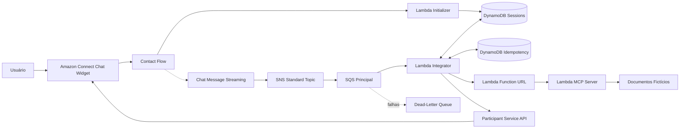
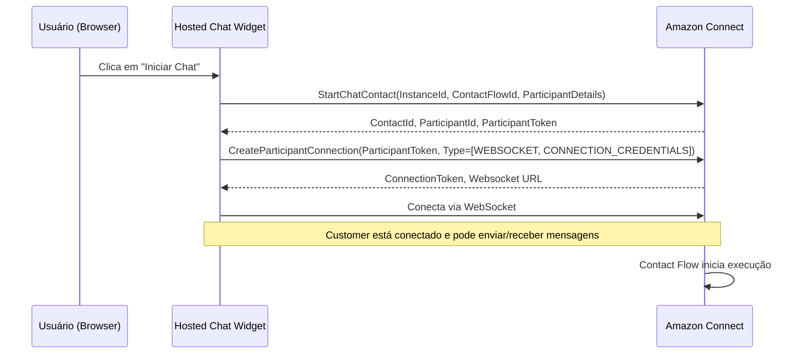
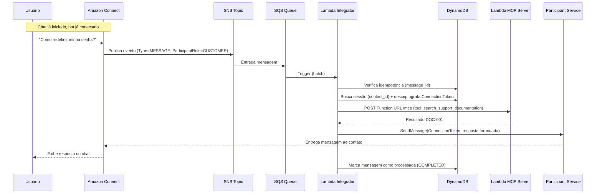

# ARCHITECTURE.md — POC Amazon Connect Chat + MCP

## 1. Visão Geral

Esta POC demonstra a integração entre Amazon Connect (chat) e um servidor MCP (Model Context Protocol) fictício, usando Lambda como camada de processamento e Terraform como IaC.

**O que NÃO usamos:**
- Amazon Q Business
- Amazon Q in Connect
- Amazon Lex
- AWS CDK / CloudFormation manual

**Decisão explícita sobre seleção de tools:**
Nesta POC, a seleção da ferramenta MCP é **determinística por palavras-chave**. Não há Q, Bedrock, LLM nem qualquer forma de raciocínio de IA. Um mapeamento estático de keywords decide qual tool invocar.

---

## 2. Diagrama de Componentes



---

## 3. Fluxos de Participantes — Customer vs CUSTOM_BOT

### 3.1 Fluxo do Customer (iniciado pelo widget)



**Quem executa:** O Hosted Chat Widget (JavaScript no browser do usuário).

**APIs envolvidas:**
1. `connect:StartChatContact` — cria o contato de chat e retorna o ParticipantToken do customer
2. `connectparticipant:CreateParticipantConnection` — o widget usa o token para obter ConnectionToken + WebSocket

**O Contact Flow inicia automaticamente** após o StartChatContact. O usuário não precisa fazer mais nada.

---

### 3.2 Fluxo do CUSTOM_BOT (iniciado pela Lambda Initializer)


**Quem executa:** A Lambda Initializer, invocada pelo bloco "Invoke AWS Lambda" do Contact Flow.

**APIs envolvidas (em ordem obrigatória):**

```
1. connect.StartContactStreaming(
       InstanceId=instance_id,
       ContactId=contact_id,
       ChatStreamingConfiguration={
           "StreamingEndpointArn": sns_topic_arn
       },
       ClientToken=str(uuid4())
   )
   → Retorna: StreamingId
   → Efeito: mensagens do chat passam a ser publicadas no SNS

2. connect.CreateParticipant(
       InstanceId=instance_id,
       ContactId=contact_id,
       ParticipantDetails={
           "DisplayName": "Assistente Virtual",
           "ParticipantRole": "CUSTOM_BOT"
       }
   )
   → Retorna: ParticipantId, ParticipantCredentials.ParticipantToken
   → Efeito: cria o participante bot dentro do contato

3. connectparticipant.CreateParticipantConnection(
       ParticipantToken=participant_token,
       ConnectParticipant=True,
       Type=["CONNECTION_CREDENTIALS"]
   )
   → Retorna: ConnectionCredentials.ConnectionToken, ConnectionCredentials.Expiry
   → Efeito: conecta o bot e fornece token para enviar mensagens
```

**Diferenças fundamentais entre os dois fluxos:**

| Aspecto | Customer | CUSTOM_BOT |
|---------|----------|------------|
| Quem inicia | Widget (browser) | Lambda Initializer (server-side) |
| API de criação | StartChatContact | CreateParticipant |
| Conexão | WebSocket + CONNECTION_CREDENTIALS | CONNECTION_CREDENTIALS apenas |
| ConnectParticipant param | Não aplicável | `true` (obrigatório) |
| Finalidade | Enviar e receber mensagens como humano | Enviar respostas programáticas |
| Timeout para conexão | Sem limite rígido documentado | **15 segundos** após CreateParticipant |

---

### 3.3 Limite crítico: 15 segundos entre CreateParticipant e CreateParticipantConnection

Após chamar `CreateParticipant`, o `ParticipantToken` retornado deve ser usado em `CreateParticipantConnection` **em até 15 segundos**. Após esse prazo, o token expira e a conexão falhará.

Implicações para a Lambda Initializer:
- As 3 chamadas (Streaming → Participant → Connection) devem ocorrer sequencialmente e rapidamente
- Não há margem para lógica pesada entre elas
- Em caso de falha na Connection, é necessário repetir o CreateParticipant

---

## 4. Diagrama de Sequência — Fluxo Completo de Mensagem



---

## 5. Componentes e Responsabilidades

### 5.1 Amazon Connect
| Aspecto | Detalhe |
|---------|---------|
| Canal | Chat (Hosted Widget) |
| Contact Flow | Invoca Lambda Initializer, aguarda mensagens, transfere se solicitado |
| Streaming | StartContactStreaming publica eventos no SNS |
| Participant | Custom participant CUSTOM_BOT envia respostas via Participant Service |

### 5.2 Lambda Initializer
| Aspecto | Detalhe |
|---------|---------|
| Trigger | Bloco "Invoke AWS Lambda" no Contact Flow |
| Timeout do bloco | Configurável no Contact Flow (padrão sugere-se 8s; máximo possível: verificar no console) |
| Limite crítico | 15 segundos entre CreateParticipant e CreateParticipantConnection |
| APIs chamadas | `connect:StartContactStreaming`, `connect:CreateParticipant`, `connectparticipant:CreateParticipantConnection` |
| Saída | Sessão salva no DynamoDB, retorna SUCCESS/ERROR ao flow |
| Runtime | Python 3.12, Lambda timeout 15s |

### 5.3 SNS Standard Topic
| Aspecto | Detalhe |
|---------|---------|
| Tipo | Standard (não FIFO) |
| Publicador | Amazon Connect (streaming endpoint) |
| Subscriber | SQS Principal |
| Nota | Mensagens podem chegar fora de ordem e duplicadas — tratamos na Integrator |

### 5.4 SQS Principal
| Aspecto | Detalhe |
|---------|---------|
| Tipo | Standard |
| VisibilityTimeout | 90s (> Lambda timeout de 60s) |
| MessageRetentionPeriod | 4 dias |
| Long Polling | 20s |
| RedrivePolicy | maxReceiveCount = 3 → DLQ |

### 5.5 SQS DLQ
| Aspecto | Detalhe |
|---------|---------|
| MessageRetentionPeriod | 14 dias |
| Alarme | ApproximateNumberOfMessagesVisible > 0 |

### 5.6 Lambda Integrator
| Aspecto | Detalhe |
|---------|---------|
| Trigger | SQS (event source mapping, batch size 5) |
| Partial Batch | ReportBatchItemFailures habilitado |
| Timeout | 60s |
| Responsabilidades | Parsear evento, idempotência, sessão, chamar MCP, responder no chat |

### 5.7 Lambda MCP Server
| Aspecto | Detalhe |
|---------|---------|
| Exposição | Lambda Function URL (HTTPS público, protegido por AWS_IAM) |
| Protocolo | MCP sobre Streamable HTTP (stateless) |
| Tools | search_support_documentation, get_support_procedure, health_check |
| Dados | Documentos fictícios em memória |
| Seleção de tool | Determinística por palavras-chave (sem IA/LLM) |

### 5.8 DynamoDB
| Tabela | PK | Propósito |
|--------|-----|-----------|
| connect-mcp-poc-sessions | `CONTACT#<contact_id>` | Sessões, tokens criptografados, estado, expiração |
| connect-mcp-poc-idempotency | `MESSAGE#<message_id>` | Controle de duplicidade |

Ambas com TTL habilitado.

### 5.9 CloudWatch
- Log Groups para cada Lambda (JSON estruturado)
- Métricas customizadas (MessagesProcessed, MCPCalls, etc.)
- Alarmes (erros, DLQ, throttling)

---

## 6. Lambda Function URL — Características e Limitações

### O que é

A Lambda Function URL é um **endpoint HTTPS público** gerado automaticamente pela AWS para uma Lambda. Formato:

```
https://<url-id>.lambda-url.<region>.on.aws
```

### Ela NÃO é privada/interna em nível de rede

A Function URL é acessível pela internet pública. Qualquer cliente com acesso à internet pode enviar requests HTTP para ela. A proteção se dá exclusivamente via **autenticação IAM (SigV4)**, não por isolamento de rede.

### Mecanismo de proteção: AWS_IAM + SigV4

Quando configuramos `auth_type = AWS_IAM`:
1. Todo request deve incluir cabeçalhos de assinatura **SigV4** (Signature Version 4)
2. A AWS valida a assinatura antes de invocar a Lambda
3. Requests sem assinatura válida recebem `403 Forbidden`

### Permissões necessárias no caller (Lambda Integrator)

A role da Lambda Integrator precisa de **ambas** as permissões:

```json
{
  "Effect": "Allow",
  "Action": [
    "lambda:InvokeFunctionUrl",
    "lambda:InvokeFunction"
  ],
  "Resource": "<mcp_server_lambda_arn>"
}
```

- `lambda:InvokeFunctionUrl` — permissão IAM para invocar via Function URL
- `lambda:InvokeFunction` — pode ser necessária dependendo da resource-based policy

### Resource-based policy na Lambda MCP Server

Além da permissão na role do caller, a Lambda MCP Server precisa de uma **resource-based policy** que autorize a role da Lambda Integrator:

```json
{
  "Effect": "Allow",
  "Principal": {
    "AWS": "<lambda_integrator_role_arn>"
  },
  "Action": "lambda:InvokeFunctionUrl",
  "Resource": "<mcp_server_lambda_arn>",
  "Condition": {
    "StringEquals": {
      "lambda:FunctionUrlAuthType": "AWS_IAM"
    }
  }
}
```

### Limitação: sem acesso privado via VPC/PrivateLink

| Aspecto | Status |
|---------|--------|
| Acesso via internet pública | ✅ Sim (único caminho) |
| Acesso privado via VPC endpoint | ❌ Não suportado |
| Acesso via PrivateLink | ❌ Não suportado |
| Acesso apenas dentro da VPC | ❌ Não possível |
| WAF diretamente | ❌ Não suportado (necessitaria CloudFront na frente) |

### Por que mantemos Function URL na POC

- Queremos validar MCP via Streamable HTTP com o SDK oficial
- A proteção IAM/SigV4 é suficiente para POC (requests não autenticados são rejeitados)
- Não há dados sensíveis no MCP Server (documentos fictícios)
- Em produção, avaliaria-se API Gateway + VPC Link ou CloudFront + WAF

### Como a Lambda Integrator faz a chamada SigV4

Usaremos `botocore.auth.SigV4Auth` ou a biblioteca `aws-requests-auth` para assinar o request HTTP antes de enviá-lo à Function URL. O SDK `requests` + assinatura SigV4 é a abordagem padrão.

---

## 7. Compatibilidade MCP com Lambda — Stack de Validação

### Stack obrigatória a validar (nesta ordem)

| Camada | Tecnologia | Papel |
|--------|-----------|-------|
| 1 | FastMCP (pacote `mcp`) | Framework MCP server |
| 2 | `stateless_http=True` | Modo sem sessão server-side |
| 3 | `json_response=True` | Resposta JSON direta (sem SSE) |
| 4 | Starlette/ASGI | Servidor HTTP interno do FastMCP |
| 5 | Mangum | Adaptador ASGI → Lambda handler |
| 6 | Lambda Function URL | Endpoint HTTPS |
| 7 | AWS_IAM auth | Proteção do endpoint |
| 8 | Cliente MCP real (SDK `mcp`) | Chamadas JSON-RPC do Integrator |

### Configuração esperada do servidor

```python
from mcp.server.fastmcp import FastMCP

mcp = FastMCP(
    name="support-mcp-server",
    stateless_http=True,
    json_response=True,  # Respostas JSON diretas, sem SSE
)
```

### Handler Lambda (Mangum)

```python
from mangum import Mangum
from mcp_server.server import mcp

# FastMCP expõe app ASGI via mcp.streamable_http_app()
app = mcp.streamable_http_app()
handler = Mangum(app, lifespan="off")
```

### Fluxo de request

```
Lambda Function URL (POST /mcp)
  → Mangum converte evento Lambda em ASGI scope
    → Starlette/FastMCP processa JSON-RPC
      → Executa tool
    → Retorna JSON response
  → Mangum converte ASGI response em Lambda response
→ Response HTTP ao caller
```

### Abordagem sobre fallback

**NÃO implementaremos fallback JSON-RPC manual nesta fase.**

Se a stack FastMCP + Mangum + Function URL não funcionar:
1. Documentar as evidências de falha (erro, traceback, incompatibilidade)
2. Parar a implementação
3. Apresentar alternativas com análise
4. Aguardar decisão

Não faremos adaptações silenciosas que transformem o MCP em REST.

### Limitações conhecidas
- **Sem estado entre invocações** — cada chamada é independente
- **Cold start** — primeira invocação ~1-3s
- **Sem SSE real** — `json_response=True` elimina essa necessidade
- **Mangum + lifespan** — desabilitamos lifespan events (`lifespan="off"`)

---

## 8. Formato do Evento SNS (Chat Streaming)

Baseado na [documentação oficial AWS](https://docs.aws.amazon.com/connect/latest/adminguide/sns-payload.html):

```json
{
  "Type": "Notification",
  "MessageId": "sns-message-id-uuid",
  "TopicArn": "arn:aws:sns:us-east-1:123456789012:connect-mcp-poc-streaming",
  "Message": "{\"AbsoluteTime\":\"2024-01-15T10:30:00.000Z\",\"Content\":\"Como redefinir minha senha?\",\"ContentType\":\"text/plain\",\"Id\":\"msg-uuid\",\"Type\":\"MESSAGE\",\"ParticipantId\":\"participant-uuid\",\"DisplayName\":\"Cliente\",\"ParticipantRole\":\"CUSTOMER\",\"InitialContactId\":\"contact-uuid\",\"ContactId\":\"contact-uuid\"}",
  "MessageAttributes": {
    "InitialContactId": {"Type": "String", "Value": "contact-uuid"},
    "MessageVisibility": {"Type": "String", "Value": "ALL"},
    "Type": {"Type": "String", "Value": "MESSAGE"},
    "ContentType": {"Type": "String", "Value": "text/plain"},
    "ContactId": {"Type": "String", "Value": "contact-uuid"},
    "ParticipantRole": {"Type": "String", "Value": "CUSTOMER"}
  }
}
```

**Campos para filtrar na Lambda Integrator:**
- `Type` == "MESSAGE" → processar (ignorar "EVENT")
- `ParticipantRole` == "CUSTOMER" → processar (ignorar "CUSTOM_BOT", "AGENT", "SYSTEM")
- `ContentType` == "text/plain" → processar (ignorar typing, joined, left, etc.)
- `Content` não vazio → processar

---

## 9. Modelo DynamoDB — Sessões

**Tabela:** `connect-mcp-poc-sessions`

| Campo | Tipo | Descrição |
|-------|------|-----------|
| pk | String (PK) | `CONTACT#<contact_id>` |
| contact_id | String | ID do contato |
| participant_id | String | ID do custom participant (CUSTOM_BOT) |
| participant_token_encrypted | Binary | ParticipantToken criptografado com KMS |
| connection_token_encrypted | Binary | ConnectionToken criptografado com KMS |
| connection_token_expiry | String | ISO-8601 — momento exato de expiração do ConnectionToken |
| streaming_id | String | ID retornado pelo StartContactStreaming |
| status | String | INITIALIZING, ACTIVE, PROCESSING, HANDOFF_REQUESTED, CLOSED, ERROR |
| created_at | String | ISO-8601 |
| updated_at | String | ISO-8601 |
| expires_at | Number | Unix epoch para TTL (created + 24h) |
| last_message_id | String | Último message_id processado |
| handoff_requested | Boolean | Se transferência foi solicitada |

### Tokens persistidos e justificativa

| Token | Persistido? | Motivo |
|-------|-------------|--------|
| ParticipantToken | Sim (criptografado) | Necessário para renovar o ConnectionToken caso expire |
| ConnectionToken | Sim (criptografado) | Necessário para SendMessage (Participant Service) |
| StreamingId | Sim (plain text) | Referência; não é sensível |

### Vencimento do ConnectionToken

O `ConnectionToken` tem uma expiração retornada pela API `CreateParticipantConnection` no campo `ConnectionCredentials.Expiry`.

**Estratégia de tratamento:**

```
Antes de usar o ConnectionToken:
1. Verificar connection_token_expiry vs now()
2. Se expirado:
   a. Usar ParticipantToken para chamar CreateParticipantConnection novamente
   b. Obter novo ConnectionToken + Expiry
   c. Atualizar sessão no DynamoDB (criptografado)
   d. Usar o novo token
3. Se válido:
   a. Descriptografar e usar normalmente
```

**Caso o ParticipantToken também esteja inválido** (contato encerrado):
- SendMessage falhará com erro
- Lambda Integrator responde com mensagem genérica ou atualiza status para CLOSED
- Não tenta reconexão infinita

### Criptografia dos Tokens (KMS)

- 1 chave KMS simétrica gerenciada pelo Terraform
- Lambda Initializer: `kms:Encrypt` → salva blobs criptografados
- Lambda Integrator: `kms:Decrypt` + `kms:Encrypt` (para salvar token renovado)
- Justificativa: tokens concedem acesso direto ao chat do usuário

---

## 10. Modelo DynamoDB — Idempotência

**Tabela:** `connect-mcp-poc-idempotency`

| Campo | Tipo | Descrição |
|-------|------|-----------|
| pk | String (PK) | `MESSAGE#<message_id>` |
| contact_id | String | Referência cruzada |
| processed_at | String | ISO-8601 |
| status | String | PROCESSING, COMPLETED, FAILED |
| expires_at | Number | Unix epoch (created + 24h) |

**Lógica de uso:**
1. Antes de processar, tenta `PutItem` com `ConditionExpression: attribute_not_exists(pk)`
2. Se sucesso → mensagem é nova, processar
3. Se `ConditionalCheckFailedException` → mensagem duplicada, ignorar
4. Após processamento bem-sucedido, atualiza status para COMPLETED

---

## 11. IAM — Permissões Mínimas

### Lambda Initializer Role
```json
{
  "Effect": "Allow",
  "Action": [
    "connect:StartContactStreaming",
    "connect:CreateParticipant"
  ],
  "Resource": "arn:aws:connect:<region>:<account>:instance/<instance_id>/*"
},
{
  "Effect": "Allow",
  "Action": ["connectparticipant:CreateParticipantConnection"],
  "Resource": "*"
},
{
  "Effect": "Allow",
  "Action": ["dynamodb:PutItem"],
  "Resource": "arn:aws:dynamodb:<region>:<account>:table/connect-mcp-poc-sessions"
},
{
  "Effect": "Allow",
  "Action": ["kms:Encrypt"],
  "Resource": "<kms_key_arn>"
}
```

### Lambda Integrator Role
```json
{
  "Effect": "Allow",
  "Action": ["dynamodb:GetItem", "dynamodb:UpdateItem"],
  "Resource": "arn:aws:dynamodb:<region>:<account>:table/connect-mcp-poc-sessions"
},
{
  "Effect": "Allow",
  "Action": ["dynamodb:PutItem", "dynamodb:GetItem"],
  "Resource": "arn:aws:dynamodb:<region>:<account>:table/connect-mcp-poc-idempotency"
},
{
  "Effect": "Allow",
  "Action": ["kms:Decrypt", "kms:Encrypt"],
  "Resource": "<kms_key_arn>"
},
{
  "Effect": "Allow",
  "Action": ["lambda:InvokeFunctionUrl", "lambda:InvokeFunction"],
  "Resource": "<mcp_server_lambda_arn>"
},
{
  "Effect": "Allow",
  "Action": ["connectparticipant:SendMessage", "connectparticipant:DisconnectParticipant", "connectparticipant:CreateParticipantConnection"],
  "Resource": "*"
},
{
  "Effect": "Allow",
  "Action": ["sqs:ReceiveMessage", "sqs:DeleteMessage", "sqs:GetQueueAttributes"],
  "Resource": "<sqs_queue_arn>"
}
```

**Nota:** A Integrator também precisa de `connectparticipant:CreateParticipantConnection` para renovar ConnectionToken expirado.

### Lambda MCP Server Role
```json
{
  "Effect": "Allow",
  "Action": ["logs:CreateLogGroup", "logs:CreateLogStream", "logs:PutLogEvents"],
  "Resource": "*"
}
```

**Nota sobre `Resource: "*"`:** As APIs do ConnectParticipant não suportam restrição por resource ARN — a autorização é feita pelo token do participante.

---

## 12. Configuração SNS → SQS

### Fluxo:
1. Amazon Connect publica no SNS Topic (configurado via StartContactStreaming)
2. SNS entrega na SQS via subscription
3. SQS Policy permite que o SNS Topic envie mensagens

### SQS Policy necessária:
```json
{
  "Effect": "Allow",
  "Principal": {"Service": "sns.amazonaws.com"},
  "Action": "sqs:SendMessage",
  "Resource": "<sqs_queue_arn>",
  "Condition": {
    "ArnEquals": {
      "aws:SourceArn": "<sns_topic_arn>"
    }
  }
}
```

### Subscription:
- Protocol: `sqs`
- Endpoint: ARN da SQS
- RawMessageDelivery: `false` (padrão) — recebemos envelope SNS completo com MessageAttributes

---

## 13. Timeout do Bloco "Invoke AWS Lambda" no Contact Flow

### Configuração no Contact Flow

O bloco "Invoke AWS Lambda" no Contact Flow permite configurar um **timeout** para a chamada. Este valor é configurável no console do Amazon Connect ao editar o bloco.

| Parâmetro | Valor |
|-----------|-------|
| Timeout do bloco (configurável) | Recomendado: 8-12 segundos |
| Lambda timeout (configurado na Lambda) | 15 segundos |

**Importante:** O timeout do bloco no Contact Flow é **independente** do timeout configurado na Lambda. O que expirar primeiro prevalece.

### Limite obrigatório: 15 segundos para CreateParticipantConnection

Independente dos timeouts configurados, existe um **limite rígido da API AWS**:

> Após chamar `CreateParticipant`, o `ParticipantToken` retornado é válido por **15 segundos** para uso em `CreateParticipantConnection`.

Isso significa que a Lambda Initializer DEVE:
1. Chamar `StartContactStreaming` (tipicamente ~200-500ms)
2. Chamar `CreateParticipant` (tipicamente ~200-500ms)
3. Chamar `CreateParticipantConnection` **imediatamente** (~200-500ms)
4. Salvar no DynamoDB (~50-100ms)

Total estimado: ~1-2 segundos. Há margem confortável para retry de uma chamada individual.

**Recomendação:** Configurar timeout do bloco no Contact Flow em **8 segundos** e Lambda timeout em **15 segundos**, garantindo que o bloco responde ao flow antes do Contact Flow assumir erro.

---

## 14. Seleção de Tool MCP — Determinística por Palavras-Chave

### Decisão explícita

Nesta POC, **não há inteligência artificial, LLM, Amazon Bedrock, Amazon Q nem qualquer modelo de linguagem** na seleção da ferramenta MCP.

A seleção é um mapeamento estático:

```python
TOOL_ROUTING = {
    "health_check": ["saúde", "status", "disponível", "health", "ping"],
    "get_support_procedure": ["procedimento", "PROC-", "passo a passo", "etapas", "como fazer"],
    "search_support_documentation": []  # fallback — qualquer outra pergunta
}
```

**Lógica:**
1. Percorrer keywords de cada tool
2. Se alguma keyword está presente na mensagem do usuário → usar aquela tool
3. Se nenhuma keyword matchear → usar `search_support_documentation` (default)

### Preparação para futuro

O código é estruturado para substituição futura por:
- Amazon Bedrock (classificação por LLM)
- Roteador baseado em embeddings
- MCP real do cliente com seleção própria

A interface `ToolSelector` terá um método `select_tool(message: str) -> str` que pode ser reimplementado.

---

## 15. Limitações Técnicas do Amazon Connect

| Limitação | Impacto | Mitigação |
|-----------|---------|-----------|
| ConnectionToken expira (tempo retornado pela API) | Sessões longas perdem capacidade de resposta | Renovar via ParticipantToken + CreateParticipantConnection; campo `connection_token_expiry` no DynamoDB |
| ParticipantToken expira se contato encerra | Bot não consegue mais responder | Detectar erro, atualizar status para CLOSED |
| SNS Standard = duplicatas possíveis | Mensagem processada 2x | Idempotência no DynamoDB |
| SNS Standard = fora de ordem | Resposta pode parecer fora de contexto | Aceitável na POC |
| Mensagem máxima chat ~16KB | Respostas longas truncadas | Dividir resposta em chunks de ~4KB |
| Contact Flow deve manter contato ativo | Se flow termina, streaming para | Bloco Wait com timeout adequado |
| 1 custom participant CUSTOM_BOT por contato | Não pode ter 2 bots | OK, temos apenas 1 bot |
| 15s entre CreateParticipant e CreateParticipantConnection | Lambda deve ser rápida | Chamadas sequenciais sem lógica intermediária |
| Function URL acessível publicamente | Exposure se credenciais vazam | Auth IAM/SigV4 impede acesso sem assinatura válida |

---

## 16. Riscos e Mitigações

| # | Risco | Probabilidade | Impacto | Mitigação |
|---|-------|---------------|---------|-----------|
| 1 | FastMCP + Mangum + Function URL incompatível | Baixa | Alto | Validar localmente primeiro; se falhar, parar e apresentar evidências |
| 2 | ConnectionToken expira durante conversa | Média | Médio | Renovar via ParticipantToken; campo expiry no DynamoDB |
| 3 | Duplicatas do SNS Standard | Alta | Baixo | Idempotência DynamoDB |
| 4 | Cold start do MCP Server | Média | Baixo | 1-3s aceitável para POC |
| 5 | Contact Flow mal configurado | Média | Alto | Documentação passo a passo |
| 6 | IAM insuficiente | Média | Alto | Terraform gerencia; terraform plan valida |
| 7 | Loop infinito (bot responde a si mesmo) | Média | Crítico | Filtro ParticipantRole != CUSTOM_BOT |
| 8 | Timeout de 15s estourado na inicialização | Baixa | Alto | Chamadas ~1-2s no total; margem confortável |
| 9 | SigV4 signing incorreto no client MCP | Média | Alto | Usar `botocore.auth.SigV4Auth` (testado pela AWS) |

---

## 17. Estrutura do Repositório

```
amazon-connect-mcp-poc/
├── README.md
├── ARCHITECTURE.md              ← este arquivo
├── SECURITY.md
├── COSTS.md
├── CHANGELOG.md
├── Makefile
├── pyproject.toml
├── requirements-dev.txt
├── .env.example
├── .gitignore
├── docs/
│   ├── amazon-connect-setup.md
│   ├── contact-flow.md
│   ├── deployment.md
│   ├── demo-script.md
│   ├── troubleshooting.md
│   ├── dlq-runbook.md
│   └── diagrams/
├── sample_documents/
│   └── documents.json
├── src/
│   ├── initializer/
│   │   ├── __init__.py
│   │   ├── handler.py
│   │   ├── config.py
│   │   └── exceptions.py
│   ├── integrator/
│   │   ├── __init__.py
│   │   ├── handler.py
│   │   ├── config.py
│   │   ├── models.py
│   │   ├── event_parser.py
│   │   ├── session_repository.py
│   │   ├── idempotency_repository.py
│   │   ├── participant_service.py
│   │   ├── mcp_service.py
│   │   ├── response_formatter.py
│   │   ├── exceptions.py
│   │   └── logging_config.py
│   ├── mcp_server/
│   │   ├── __init__.py
│   │   ├── server.py
│   │   ├── tools.py
│   │   ├── documents.py
│   │   ├── handler.py            ← entry point Lambda (Mangum)
│   │   └── local.py              ← execução local
│   ├── local_chat/
│   │   ├── __init__.py
│   │   └── __main__.py
│   └── shared/
│       ├── __init__.py
│       ├── mcp_client/
│       │   ├── __init__.py
│       │   ├── client.py
│       │   ├── models.py
│       │   ├── exceptions.py
│       │   └── tool_selector.py
│       ├── crypto.py
│       └── constants.py
├── terraform/
│   ├── versions.tf
│   ├── providers.tf
│   ├── variables.tf
│   ├── locals.tf
│   ├── outputs.tf
│   ├── main.tf
│   ├── data.tf
│   ├── iam.tf
│   ├── lambda.tf
│   ├── sns.tf
│   ├── sqs.tf
│   ├── dynamodb.tf
│   ├── cloudwatch.tf
│   ├── kms.tf
│   ├── connect.tf
│   └── terraform.tfvars.example
├── scripts/
│   ├── build_lambdas.sh
│   ├── package_initializer.sh
│   ├── package_integrator.sh
│   ├── package_mcp_server.sh
│   ├── deploy.sh
│   ├── destroy.sh
│   └── validate.sh
└── tests/
    ├── conftest.py
    ├── unit/
    │   ├── test_event_parser.py
    │   ├── test_session_repository.py
    │   ├── test_idempotency_repository.py
    │   ├── test_mcp_tools.py
    │   ├── test_tool_selector.py
    │   ├── test_participant_service.py
    │   ├── test_response_formatter.py
    │   ├── test_initializer.py
    │   └── test_integrator.py
    ├── integration/
    │   └── test_mcp_server.py
    └── fixtures/
        ├── sns_events.py
        └── connect_events.py
```

---

## 18. Backlog (fora da POC)

1. Substituir MCP fictício por MCP real do cliente
2. Usar Amazon Bedrock para seleção inteligente de tools
3. Provisioned concurrency para eliminar cold start
4. VPC + PrivateLink para comunicação privada (quando disponível ou via API Gateway + VPC Link)
5. CloudFront + WAF na frente da Function URL
6. X-Ray para tracing distribuído
7. Multi-idioma nos documentos
8. Histórico de conversa para contexto do MCP
9. Rate limiting por ContactId
10. Testes de carga com Artillery/Locust
11. CI/CD pipeline (GitHub Actions)
12. Dashboards CloudWatch customizados

---

## 19. Critérios de Aceite da POC

- [ ] `terraform validate` passa sem erros
- [ ] `terraform plan` executa com sucesso
- [ ] Infraestrutura criada sem erros manuais
- [ ] Lambdas empacotadas e deployadas
- [ ] Chat inicia via widget do Amazon Connect
- [ ] Evento de mensagem chega ao SNS
- [ ] Mensagem chega à SQS
- [ ] Lambda Integrator consome a mensagem
- [ ] MCP Server responde corretamente (via FastMCP + Mangum + Function URL)
- [ ] Resposta aparece no chat do usuário
- [ ] Duplicidade evitada (mesma mensagem não gera 2 respostas)
- [ ] Erros tratados graciosamente (usuário recebe mensagem amigável)
- [ ] DLQ recebe mensagens com falha persistente (após 3 tentativas)
- [ ] Logs possuem ContactId em todos os registros
- [ ] Testes passam com cobertura ≥ 80%
- [ ] Documentação permite reprodução por terceiros
- [ ] `terraform destroy` limpa todos os recursos
- [ ] Seleção de tool é determinística (sem IA/LLM)
- [ ] ConnectionToken expirado é tratado com renovação ou erro gracioso


---

## 20. Política de Erros do MCP Client

### Classificação de erros

| Categoria | Exemplos | Resultado no MCPClient | Ação na Lambda Integrator |
|-----------|----------|----------------------|--------------------------|
| Negócio/ausência | Documento não encontrado, procedimento inexistente | `ToolResult(success=True, data={"document_id": None, ...})` | Envia resposta de fallback ao chat. Mensagem é marcada como processada (COMPLETED). |
| Entrada inválida | HTTP 400, schema inválido | `MCPClientError` propagada | Envia mensagem genérica ao chat. Mensagem marcada como COMPLETED (não faz sentido retry). |
| Transitório — timeout | `httpx.TimeoutException` após retries | `ToolResult(success=False, error="Timeout...")` | **NÃO marca como processada.** Lambda falha o registro SQS. SQS faz retry. Após 3 falhas → DLQ. |
| Transitório — conexão | `httpx.ConnectError` após retries | `ToolResult(success=False, error="Falha ao conectar...")` | Mesmo tratamento: retry via SQS → DLQ. |
| Transitório — server error | HTTP 5xx | `ToolResult(success=False, error="Server returned 5xx...")` | Mesmo tratamento: retry via SQS → DLQ. |
| Fatal — JSON-RPC error | Código -32601 (method not found) | `ToolResult(success=False, error="JSON-RPC error...")` | Erro de configuração. Marca FAILED. Envia mensagem genérica. Não faz retry (não é transitório). |

### Regras obrigatórias

1. **Erros transitórios NUNCA devem ser tratados como sucesso da mensagem.** A mensagem não é deletada da SQS, forçando retry automático.

2. **Erros de negócio (fallback) SÃO sucesso de processamento.** A mensagem foi consumida corretamente, a resposta foi enviada ao chat (mesmo que seja "não encontrei").

3. **Erros fatais (configuração, JSON-RPC) são marcados como FAILED** no DynamoDB de idempotência. Não geram retry (pois o resultado seria o mesmo). Uma mensagem genérica é enviada ao usuário.

4. **Distinguir no ToolResult:**
   - `success=True` → processamento OK, pode enviar `data` ao chat
   - `success=False` + erro transitório → Lambda deve falhar o registro (raise exception)
   - `success=False` + erro fatal → Lambda marca como FAILED, não faz retry

### Implementação futura na Lambda Integrator

```python
result = mcp_client.call_tool(tool_name, arguments)

if result.success:
    # Enviar resposta ao chat
    send_chat_message(connection_token, format_response(result))
    mark_as_completed(message_id)
elif is_transient_error(result.error):
    # NÃO marca como processada — SQS fará retry
    raise TransientMCPError(result.error)
else:
    # Erro fatal — envia mensagem genérica, marca como FAILED
    send_chat_message(connection_token, GENERIC_ERROR_MESSAGE)
    mark_as_failed(message_id)
```

### Classificação de erro transitório

```python
def is_transient_error(error: str | None) -> bool:
    """Verifica se o erro é transitório (deve gerar retry)."""
    if error is None:
        return False
    transient_indicators = ["timeout", "Timeout", "conectar", "Falha ao conectar", "5xx", "500", "502", "503"]
    return any(indicator in error for indicator in transient_indicators)
```
