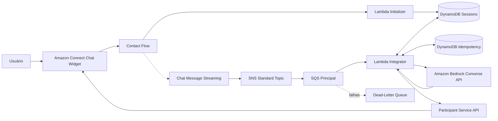
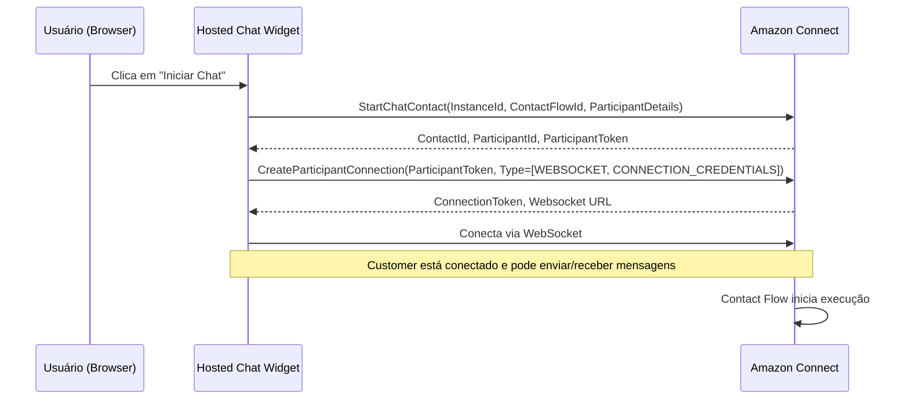
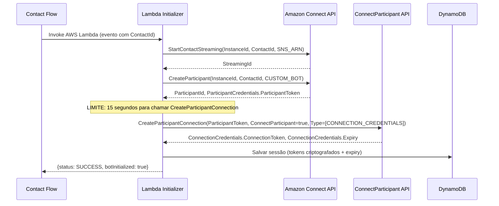
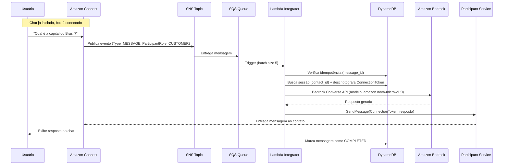

# ARCHITECTURE.md — POC Amazon Connect + Bedrock Converse

## 1. Visão Geral

Esta POC demonstra a integração entre Amazon Connect (chat) e Amazon Bedrock Converse API, usando Lambda como camada de processamento e Terraform como IaC.

**Modelo utilizado:** `amazon.nova-micro-v1:0`
**Região:** `us-east-1`
**Profile AWS:** `connect-poc`

**O que usamos:**
- Amazon Connect (chat widget + Contact Flow)
- Amazon Bedrock Converse API (geração de respostas)
- AWS Lambda (processamento)
- SNS/SQS (mensageria assíncrona)
- DynamoDB (sessões + idempotência)
- KMS (criptografia de tokens)
- Terraform (infraestrutura como código)

---

## 2. Diagrama de Componentes



---

## 3. Fluxos de Participantes — Customer vs CUSTOM_BOT

### 3.1 Fluxo do Customer (iniciado pelo widget)



**Quem executa:** O Hosted Chat Widget (JavaScript no browser do usuário).

### 3.2 Fluxo do CUSTOM_BOT (iniciado pela Lambda Initializer)



### 3.3 Limite crítico: 15 segundos entre CreateParticipant e CreateParticipantConnection

Após chamar `CreateParticipant`, o `ParticipantToken` retornado deve ser usado em `CreateParticipantConnection` em até 15 segundos. A Lambda Initializer executa as 3 chamadas sequencialmente em ~1-2 segundos.

---

## 4. Diagrama de Sequência — Fluxo Completo de Mensagem



---

## 5. Componentes e Responsabilidades

### 5.1 Amazon Connect
| Aspecto | Detalhe |
|---------|---------|
| Canal | Chat (Hosted Widget) |
| Contact Flow | `connect-bedrock-poc-dev-chat-flow` |
| Streaming | StartContactStreaming publica eventos no SNS |
| Participant | CUSTOM_BOT envia respostas via Participant Service |

### 5.2 Lambda Initializer
| Aspecto | Detalhe |
|---------|---------|
| Nome | `connect-bedrock-poc-dev-initializer` |
| Trigger | Bloco "Invoke AWS Lambda" no Contact Flow |
| Timeout | 8 segundos |
| APIs chamadas | `connect:StartContactStreaming`, `connect:CreateParticipant`, `connectparticipant:CreateParticipantConnection` |
| Saída | Sessão salva no DynamoDB (tokens criptografados via KMS), retorna SUCCESS/ERROR |
| Runtime | Python 3.12 |

### 5.3 Lambda Integrator
| Aspecto | Detalhe |
|---------|---------|
| Nome | `connect-bedrock-poc-dev-integrator` |
| Trigger | SQS (event source mapping, batch size 5) |
| Partial Batch | ReportBatchItemFailures habilitado |
| Timeout | 60 segundos |
| Responsabilidades | Parsear evento SNS, idempotência, buscar sessão, chamar Bedrock, responder no chat |
| Runtime | Python 3.12 |

### 5.4 Amazon Bedrock (Converse API)
| Aspecto | Detalhe |
|---------|---------|
| Modelo | `amazon.nova-micro-v1:0` |
| API | `bedrock-runtime:Converse` |
| Timeout | Configurável via `BEDROCK_TIMEOUT_SECONDS` (padrão 20s) |
| Max tokens | Configurável via `BEDROCK_MAX_TOKENS` (padrão 1024) |
| Temperature | Configurável via `BEDROCK_TEMPERATURE` (padrão 0.7) |
| System prompt | Agente virtual de suporte em português |

### 5.5 SNS Standard Topic
| Aspecto | Detalhe |
|---------|---------|
| Nome | `connect-bedrock-poc-dev-streaming` |
| Tipo | Standard (não FIFO) |
| Publicador | Amazon Connect (streaming endpoint) |
| Subscriber | SQS Principal |

### 5.6 SQS Principal
| Aspecto | Detalhe |
|---------|---------|
| Nome | `connect-bedrock-poc-dev-messages` |
| VisibilityTimeout | 360 segundos |
| MessageRetentionPeriod | 4 dias |
| Long Polling | 20 segundos |
| RedrivePolicy | maxReceiveCount = 3 → DLQ |

### 5.7 SQS DLQ
| Aspecto | Detalhe |
|---------|---------|
| Nome | `connect-bedrock-poc-dev-messages-dlq` |
| MessageRetentionPeriod | 14 dias |
| Alarme | ApproximateNumberOfMessagesVisible > 0 |

### 5.8 DynamoDB
| Tabela | PK | Propósito |
|--------|-----|-----------|
| `connect-bedrock-poc-dev-sessions` | `CONTACT#<contact_id>` | Sessões, tokens criptografados, estado |
| `connect-bedrock-poc-dev-idempotency` | `MESSAGE#<message_id>` | Controle de duplicidade |

Ambas com TTL habilitado (24h), criptografia server-side via KMS.

### 5.9 KMS
| Aspecto | Detalhe |
|---------|---------|
| Alias | `alias/connect-bedrock-poc-dev-tokens` |
| Uso | Criptografar ParticipantToken e ConnectionToken antes de persistir no DynamoDB |
| Key rotation | Habilitada |

### 5.10 CloudWatch
- Log Groups para cada Lambda (JSON estruturado)
- Metric Filters (FailedFinal)
- Alarmes: DLQ não vazia, erros Lambda > 2, throttling

---

## 6. Modelo DynamoDB — Sessões

**Tabela:** `connect-bedrock-poc-dev-sessions`

| Campo | Tipo | Descrição |
|-------|------|-----------|
| pk | String (PK) | `CONTACT#<contact_id>` |
| contact_id | String | ID do contato |
| participant_id | String | ID do CUSTOM_BOT |
| participant_token_encrypted | Binary | ParticipantToken criptografado via KMS |
| connection_token_encrypted | Binary | ConnectionToken criptografado via KMS |
| connection_token_expiry | String | ISO-8601 — expiração do ConnectionToken |
| streaming_id | String | ID retornado pelo StartContactStreaming |
| status | String | ACTIVE, PROCESSING, CLOSED, ERROR |
| created_at | String | ISO-8601 |
| updated_at | String | ISO-8601 |
| expires_at | Number | Unix epoch para TTL (created + 24h) |

### Renovação do ConnectionToken

Quando o ConnectionToken expira durante o processamento:
1. Descriptografar ParticipantToken
2. Chamar CreateParticipantConnection novamente
3. Criptografar e persistir novo ConnectionToken
4. Retentar envio da resposta

---

## 7. Modelo DynamoDB — Idempotência

**Tabela:** `connect-bedrock-poc-dev-idempotency`

| Campo | Tipo | Descrição |
|-------|------|-----------|
| pk | String (PK) | `MESSAGE#<message_id>` |
| contact_id | String | Referência cruzada |
| status | String | PROCESSING, COMPLETED, FAILED_FINAL |
| processed_at | String | ISO-8601 |
| expires_at | Number | Unix epoch (created + 24h) |

**Lógica:** Lease de 90 segundos no estado PROCESSING. Mensagens com status COMPLETED ou FAILED_FINAL são ignoradas.

---

## 8. Tratamento de Erros — Classificação

### Erros Transitórios (retry via SQS)
- `ThrottlingException` — limite de rate do Bedrock
- `ServiceUnavailableException` — serviço temporariamente indisponível
- `ModelTimeoutException` — modelo demorou demais
- `ReadTimeoutError` — timeout de rede
- Erros transitórios de DynamoDB

Após 3 falhas consecutivas → mensagem vai para DLQ.

### Erros Fatais (FAILED_FINAL, sem retry)
- `AccessDeniedException` — IAM ou model access incorreto
- `ValidationException` — parâmetros inválidos (model_id, maxTokens, etc.)
- `ModelNotFoundException` — modelo não existe na região

### Ações de Diagnóstico

Seguir o workflow documentado em `.kiro/steering/bedrock-debugging.md`:
1. Obter correlation_id
2. Rastrear logs no CloudWatch
3. Verificar sequência esperada
4. Classificar erro
5. Aplicar correção
6. Validar com smoke test

---

## 9. IAM — Permissões

### Lambda Initializer
- `connect:StartContactStreaming` (Resource: `*`)
- `connect:CreateParticipant` (Resource: `*`)
- `dynamodb:GetItem`, `PutItem`, `UpdateItem` (Resource: tabela sessions)
- `kms:Encrypt`, `GenerateDataKey` (Resource: KMS key)
- `lambda:InvokeFunction` — resource-based policy permite Connect invocar

### Lambda Integrator
- `sqs:ReceiveMessage`, `DeleteMessage`, `GetQueueAttributes` (Resource: fila SQS)
- `dynamodb:GetItem`, `UpdateItem` (Resource: tabela sessions)
- `dynamodb:GetItem`, `PutItem`, `UpdateItem` (Resource: tabela idempotency)
- `kms:Decrypt`, `Encrypt`, `GenerateDataKey` (Resource: KMS key)
- `bedrock:InvokeModel` (Resource: ARN do modelo Nova Micro)

**Nota:** APIs do ConnectParticipant não suportam restrição por resource ARN — autorização é pelo token.

---

## 10. Formato do Evento SNS (Chat Streaming)

```json
{
  "Type": "Notification",
  "Message": "{\"Content\":\"Qual é a capital do Brasil?\",\"Type\":\"MESSAGE\",\"ParticipantRole\":\"CUSTOMER\",\"ContactId\":\"contact-uuid\",\"Id\":\"msg-uuid\",...}",
  "MessageAttributes": {
    "Type": {"Type": "String", "Value": "MESSAGE"},
    "ParticipantRole": {"Type": "String", "Value": "CUSTOMER"},
    "ContactId": {"Type": "String", "Value": "contact-uuid"}
  }
}
```

**Filtros na Lambda Integrator:**
- `Type` == "MESSAGE" (ignorar "EVENT")
- `ParticipantRole` == "CUSTOMER" (ignorar "CUSTOM_BOT", "SYSTEM")
- `Content` não vazio

---

## 11. Configuração do Bedrock Client

Variáveis de ambiente da Lambda Integrator:

| Variável | Padrão | Descrição |
|----------|--------|-----------|
| `BEDROCK_MODEL_ID` | (obrigatória) | ID do modelo (amazon.nova-micro-v1:0) |
| `BEDROCK_MAX_TOKENS` | 1024 | Máximo de tokens na resposta [1, 4096] |
| `BEDROCK_TEMPERATURE` | 0.7 | Temperatura [0.0, 1.0] |
| `BEDROCK_TIMEOUT_SECONDS` | 20 | Timeout da chamada [5, ∞) |
| `BEDROCK_SYSTEM_PROMPT` | (prompt padrão pt-BR) | System prompt para o modelo |

### System Prompt Padrão

```
Você é um agente virtual de suporte.
Responda sempre em português brasileiro.
Seja claro e objetivo nas respostas.
Não invente informações que não estejam disponíveis.
Informe ao usuário quando não tiver dados suficientes para responder.
```

---

## 12. Build e Deploy

### Build dos Pacotes Lambda

O script `scripts/build_lambdas.ps1` gera os ZIPs preservando a estrutura de diretórios:

```
packages/initializer.zip
  ├── initializer/
  ├── shared/
  └── integrator/__init__.py + exceptions.py

packages/integrator.zip
  ├── integrator/
  └── shared/
```

**Handlers Terraform:**
- `initializer.handler.handler`
- `integrator.handler.handler`

**IMPORTANTE:** Não usar `Compress-Archive` diretamente sobre `src/initializer/*` — isso remove a estrutura de pacotes e causa `Runtime.ImportModuleError`.

### Deploy

```powershell
$env:AWS_PROFILE = "connect-poc"
cd terraform
terraform init
terraform plan
terraform apply
```

---

## 13. Observabilidade

### Logs Estruturados (JSON)

Todas as Lambdas emitem logs em JSON com campos de primeiro nível:
- `timestamp`, `level`, `logger`, `message`
- `correlation_id` — derivado do MessageId do evento
- `metric` — para CloudWatch Metric Filters (ex: "FailedFinal")

### Alarmes CloudWatch

| Alarme | Condição | Ação |
|--------|----------|------|
| DLQ não vazia | ApproximateNumberOfMessagesVisible > 0 | Notificação |
| Erros Initializer | Errors > 2 em 10 min | Notificação |
| Erros Integrator | Errors > 2 em 10 min | Notificação |
| Throttling Integrator | Throttles > 0 | Notificação |
| Mensagem antiga SQS | Age > 5 min | Notificação |
| FailedFinal | Metric Filter > 0 | Notificação |

---

## 14. Limitações Técnicas

| Limitação | Impacto | Mitigação |
|-----------|---------|-----------|
| ConnectionToken expira | Sessões longas perdem resposta | Renovar via ParticipantToken |
| SNS Standard = duplicatas | Mensagem processada 2x | Idempotência DynamoDB |
| SNS Standard = fora de ordem | Aceitável para POC | — |
| Mensagem chat ~16KB max | Respostas longas truncadas | maxTokens = 1024 |
| Cold start Lambda | ~1-2s na primeira invocação | Aceitável para POC |
| 15s entre CreateParticipant e Connection | Lambda deve ser rápida | Chamadas ~1-2s total |
| Bedrock throttling | Rate limit por modelo | Retry automático via SQS |

---

## 15. Decisões Arquiteturais

| Decisão | Alternativas Consideradas | Justificativa |
|---------|--------------------------|---------------|
| Bedrock Converse API (não Invoke) | InvokeModel | Converse oferece interface unificada multi-modelo |
| Amazon Nova Micro | Claude, Titan | Menor custo, latência adequada para POC |
| SNS → SQS (não invocação direta) | Lambda direta do Contact Flow | Resiliência, retry, DLQ |
| DynamoDB (não ElastiCache) | Redis | Serverless, TTL nativo, sem gerenciamento |
| KMS (não secrets manager) | Secrets Manager | Criptografia in-line, menor latência |
| Terraform (não CDK/CF) | AWS CDK, CloudFormation | Equipe já familiarizada |

---

## 16. Evolução Planejada

| POC | Descrição | Status |
|-----|-----------|--------|
| poc_connect_mcp | Connect + MCP Protocol | ✅ Concluída |
| poc_connect_bedrock | Connect + Bedrock Converse (esta) | ✅ Concluída |
| poc_connect_bedrock_rag | Connect + Bedrock Knowledge Bases (RAG) | 🔄 Em planejamento |
| poc_connect_bedrock_agent | Connect + Bedrock Agents | 📋 Futuro |
