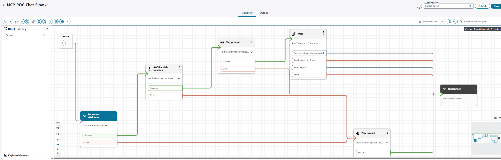

# Manual Completo de Implantação — POC Amazon Connect + MCP

> **Status da infraestrutura:**
> - `terraform fmt` — ✅ concluído
> - `terraform init` — ✅ concluído
> - `terraform validate` — ✅ concluído
> - `terraform plan` — ✅ concluído
> - `terraform apply` — ✅ concluído (Apply final: 16 added, 0 changed, 0 destroyed)
> - Infraestrutura Terraform — ✅ criada
> - Lambda Initializer — ✅ criada na AWS
> - Lambda Integrator — ✅ criada na AWS
> - Lambda MCP Server — ✅ criada na AWS
> - MCP Server Function URL — ✅ criada
> - Event Source Mapping SQS → Integrator — ✅ criado
> - IAM Roles com sufixo `-PPD` e permissions boundary — ✅ criadas
> - Lambda Initializer autorizada no Amazon Connect — ⏳ pendente
> - Contact Flow — ⏳ pendente
> - Communications Widget — ⏳ pendente
>
> **Próximos passos (manuais):**
> 1. Autorizar `connect-mcp-poc-dev-initializer` na instância Amazon Connect
> 2. Criar o Contact Flow de Chat (`MCP-POC-Chat-Flow`)
> 3. Criar o Communications Widget em português
>
> **Última atualização:** Junho 2026
> **Ambiente de referência:** Windows 11, PowerShell, AWS CLI v2, Terraform >= 1.6
> **Runtime de destino:** Python 3.12 (recomendado; runtime Lambda configurado)

---

## A. Visão Geral da Arquitetura

### Fluxo real da POC

```
Cliente (browser)
  → Hosted Chat Widget
    → Amazon Connect Contact Flow
      → Lambda Initializer (invocada pelo bloco "Invoke AWS Lambda")
        → connect:StartContactStreaming → SNS Topic
        → connect:CreateParticipant (CUSTOM_BOT)
        → connectparticipant:CreateParticipantConnection
        → DynamoDB Sessions (tokens criptografados com KMS)
      → Contact Flow mantém sessão ativa

Mensagens do chat:
  → Amazon Connect Chat Streaming
    → SNS Topic (connect-mcp-poc-dev-streaming)
      → SQS Queue (connect-mcp-poc-dev-messages)
        → Lambda Integrator (event source mapping, batch_size=5)
          → DynamoDB Idempotency (lease-based)
          → DynamoDB Sessions (busca token)
          → KMS Decrypt (ConnectionToken)
          → Lambda Function URL (MCP Server, via SigV4)
            → FastMCP + Mangum → tool search/procedure/health
          → connectparticipant:SendMessage (ConnectionToken)
          → Resposta aparece no chat do cliente

Falhas:
  → SQS VisibilityTimeout (360s) → retry
  → maxReceiveCount (3) → DLQ (connect-mcp-poc-dev-messages-dlq)
  → FAILED_FINAL → CloudWatch Metric Filter → Alarme
```

### Tabela de componentes

| Componente | Criado por | Finalidade | Onde configurar |
|------------|-----------|------------|-----------------|
| Instância Amazon Connect | MANUAL | Plataforma de chat | Console AWS → Amazon Connect |
| Contact Flow | MANUAL | Orquestra o chat, invoca Initializer | Console Amazon Connect |
| Communications Widget (widget de chat hospedado) | MANUAL | Interface do usuário no browser | Console Amazon Connect |
| Lambda Initializer | AUTOMÁTICO (Terraform) | Registra bot no contato | `terraform/lambda.tf` |
| Lambda Integrator | AUTOMÁTICO (Terraform) | Processa mensagens, chama MCP | `terraform/lambda.tf` |
| Lambda MCP Server | AUTOMÁTICO (Terraform) | Servidor MCP fictício | `terraform/lambda.tf` |
| Function URL (MCP) | AUTOMÁTICO (Terraform) | Endpoint HTTPS com AWS_IAM | `terraform/function_url.tf` |
| DynamoDB Sessions | AUTOMÁTICO (Terraform) | Sessões e tokens criptografados | `terraform/dynamodb.tf` |
| DynamoDB Idempotency | AUTOMÁTICO (Terraform) | Controle de duplicidade | `terraform/dynamodb.tf` |
| KMS Key | AUTOMÁTICO (Terraform) | Criptografia de tokens | `terraform/kms.tf` |
| SNS Topic | AUTOMÁTICO (Terraform) | Streaming de mensagens Connect | `terraform/sns.tf` |
| SQS Queue | AUTOMÁTICO (Terraform) | Buffer de mensagens | `terraform/sqs.tf` |
| SQS DLQ | AUTOMÁTICO (Terraform) | Mensagens com falha persistente | `terraform/sqs.tf` |
| Event Source Mapping | AUTOMÁTICO (Terraform) | SQS → Lambda Integrator | `terraform/event_source.tf` |
| IAM Roles (3) | AUTOMÁTICO (Terraform) | Permissões das Lambdas | `terraform/iam.tf` |
| CloudWatch Log Groups | AUTOMÁTICO (Terraform) | Logs das Lambdas | `terraform/monitoring.tf` |
| Metric Filter | AUTOMÁTICO (Terraform) | Captura FailedFinal | `terraform/monitoring.tf` |
| Alarmes (6) | AUTOMÁTICO (Terraform) | Alertas operacionais | `terraform/monitoring.tf` |
| Autorização Lambda no Connect | MANUAL | Permite Contact Flow invocar Lambda | Console Amazon Connect |

---

## B. O que o Terraform Cria — Inventário Completo (33 recursos)

> Baseado no `terraform plan` final. Nomes usam `{env}` = valor de `environment_name` (default: `dev`).

### Tabela completa de recursos

| # | Recurso Terraform | Nome AWS | Serviço | Finalidade | Arquivo .tf | Output |
|---|-------------------|----------|---------|-----------|-------------|--------|
| 1 | `aws_lambda_function.initializer` | `connect-mcp-poc-{env}-initializer` | Lambda | Inicializa bot no contato | `lambda.tf` | `initializer_lambda_arn` |
| 2 | `aws_lambda_function.integrator` | `connect-mcp-poc-{env}-integrator` | Lambda | Processa mensagens do chat | `lambda.tf` | `integrator_lambda_arn` |
| 3 | `aws_lambda_function.mcp_server` | `connect-mcp-poc-{env}-mcp-server` | Lambda | Servidor MCP fictício | `lambda.tf` | `mcp_server_lambda_arn` |
| 4 | `aws_lambda_function_url.mcp_server` | `https://<id>.lambda-url.<region>.on.aws` | Lambda | Endpoint HTTPS do MCP (AWS_IAM) | `function_url.tf` | `mcp_server_function_url` |
| 5 | `aws_lambda_event_source_mapping.sqs_to_integrator` | — | Lambda | SQS → Integrator (batch=5, partial) | `event_source.tf` | — |
| 6 | `aws_iam_role.initializer` | `connect-mcp-poc-{env}-initializer-ExecutionRole-PPD` | IAM | Role da Initializer | `iam.tf` | — |
| 7 | `aws_iam_role.integrator` | `connect-mcp-poc-{env}-integrator-ExecutionRole-PPD` | IAM | Role do Integrator | `iam.tf` | — |
| 8 | `aws_iam_role.mcp_server` | `connect-mcp-poc-{env}-mcp-server-ExecutionRole-PPD` | IAM | Role do MCP Server | `iam.tf` | — |
| 9 | `aws_iam_role_policy.initializer` | `connect-mcp-poc-{env}-initializer-policy` | IAM | Policy inline: DynamoDB, KMS, Connect | `iam.tf` | — |
| 10 | `aws_iam_role_policy.integrator` | `connect-mcp-poc-{env}-integrator-policy` | IAM | Policy inline: SQS, DynamoDB, KMS, Lambda | `iam.tf` | — |
| 11 | `aws_iam_role_policy_attachment.initializer_basic` | — | IAM | AWSLambdaBasicExecutionRole | `iam.tf` | — |
| 12 | `aws_iam_role_policy_attachment.integrator_basic` | — | IAM | AWSLambdaBasicExecutionRole | `iam.tf` | — |
| 13 | `aws_iam_role_policy_attachment.mcp_server_basic` | — | IAM | AWSLambdaBasicExecutionRole | `iam.tf` | — |
| 14 | `aws_dynamodb_table.sessions` | `connect-mcp-poc-{env}-sessions` | DynamoDB | Sessões e tokens criptografados | `dynamodb.tf` | `sessions_table_name` |
| 15 | `aws_dynamodb_table.idempotency` | `connect-mcp-poc-{env}-idempotency` | DynamoDB | Controle de duplicidade (lease) | `dynamodb.tf` | `idempotency_table_name` |
| 16 | `aws_kms_key.tokens` | — (gerado pela AWS) | KMS | Criptografia de tokens | `kms.tf` | `kms_key_arn` |
| 17 | `aws_kms_alias.tokens` | `alias/connect-mcp-poc-{env}-tokens` | KMS | Alias legível para a chave | `kms.tf` | — |
| 18 | `aws_sns_topic.streaming` | `connect-mcp-poc-{env}-streaming` | SNS | Streaming de mensagens Connect | `sns.tf` | `sns_topic_arn` |
| 19 | `aws_sns_topic_policy.allow_connect` | — (inline no topic) | SNS | Permite Connect publicar (sns:Publish) | `sns.tf` | — |
| 20 | `aws_sns_topic_subscription.sqs` | — | SNS | Entrega mensagens SNS → SQS | `sns.tf` | — |
| 21 | `aws_sqs_queue.messages` | `connect-mcp-poc-{env}-messages` | SQS | Fila principal de mensagens | `sqs.tf` | `sqs_queue_url` |
| 22 | `aws_sqs_queue.dlq` | `connect-mcp-poc-{env}-messages-dlq` | SQS | Dead-letter queue (14 dias) | `sqs.tf` | `sqs_dlq_url` |
| 23 | `aws_sqs_queue_policy.allow_sns` | — (inline na queue) | SQS | Permite SNS publicar na fila | `sqs.tf` | — |
| 24 | `aws_cloudwatch_log_group.initializer` | `/aws/lambda/connect-mcp-poc-{env}-initializer` | CloudWatch | Logs da Initializer | `monitoring.tf` | — |
| 25 | `aws_cloudwatch_log_group.integrator` | `/aws/lambda/connect-mcp-poc-{env}-integrator` | CloudWatch | Logs do Integrator | `monitoring.tf` | — |
| 26 | `aws_cloudwatch_log_group.mcp_server` | `/aws/lambda/connect-mcp-poc-{env}-mcp-server` | CloudWatch | Logs do MCP Server | `monitoring.tf` | — |
| 27 | `aws_cloudwatch_log_metric_filter.failed_final` | `connect-mcp-poc-{env}-failed-final` | CloudWatch | Captura `{ $.metric = "FailedFinal" }` | `monitoring.tf` | — |
| 28 | `aws_cloudwatch_metric_alarm.failed_final` | `connect-mcp-poc-{env}-failed-final` | CloudWatch | Alarme: FailedFinal > 0 | `monitoring.tf` | — |
| 29 | `aws_cloudwatch_metric_alarm.dlq_messages` | `connect-mcp-poc-{env}-dlq-not-empty` | CloudWatch | Alarme: DLQ não vazia | `monitoring.tf` | — |
| 30 | `aws_cloudwatch_metric_alarm.initializer_errors` | `connect-mcp-poc-{env}-initializer-errors` | CloudWatch | Alarme: Errors Initializer > 2 | `monitoring.tf` | — |
| 31 | `aws_cloudwatch_metric_alarm.integrator_errors` | `connect-mcp-poc-{env}-integrator-errors` | CloudWatch | Alarme: Errors Integrator > 2 | `monitoring.tf` | — |
| 32 | `aws_cloudwatch_metric_alarm.integrator_throttles` | `connect-mcp-poc-{env}-integrator-throttles` | CloudWatch | Alarme: Throttles > 0 | `monitoring.tf` | — |
| 33 | `aws_cloudwatch_metric_alarm.sqs_oldest_message` | `connect-mcp-poc-{env}-sqs-oldest-message` | CloudWatch | Alarme: mensagem > 5min | `monitoring.tf` | — |

> **Nota:** Com `alarm_email = ""` (padrão), o plan cria 33 recursos. Se `alarm_email` for preenchido, o plan inclui +2 recursos condicionais (`aws_sns_topic.alarms` e `aws_sns_topic_subscription.alarm_email`), totalizando 35.

### Governança IAM — Padrão Obrigatório da Conta AWS

Todas as IAM Roles criadas nesta conta devem cumprir obrigatoriamente:

#### 1. Sufixo no nome

O nome da role deve terminar em `-PPD`. Nomes usados nesta POC:

```
connect-mcp-poc-dev-initializer-ExecutionRole-PPD
connect-mcp-poc-dev-integrator-ExecutionRole-PPD
connect-mcp-poc-dev-mcp-server-ExecutionRole-PPD
```

#### 2. Permissions Boundary obrigatória

```
arn:aws:iam::253223147282:policy/ContributorBoundaryPolicy-ITSM-145407
```

Exemplo Terraform:
```hcl
resource "aws_iam_role" "exemplo" {
  name                 = "MinhaRole-ExecutionRole-PPD"
  assume_role_policy   = data.aws_iam_policy_document.assume.json
  permissions_boundary = "arn:aws:iam::253223147282:policy/ContributorBoundaryPolicy-ITSM-145407"

  tags = {
    Project = "AWS-PPD"
  }
}
```

#### 3. Tag obrigatória

```hcl
tags = {
  Project = "AWS-PPD"
}
```

#### 4. Least privilege

Cada role recebe somente as permissões necessárias:
- **Initializer:** Amazon Connect (StartContactStreaming, CreateParticipant), DynamoDB Sessions, KMS Encrypt
- **Integrator:** SQS, DynamoDB (2 tabelas), KMS (Encrypt/Decrypt), lambda:InvokeFunctionUrl
- **MCP Server:** Apenas AWSLambdaBasicExecutionRole (logs)

#### 5. Causa da falha no primeiro apply

O primeiro `terraform apply` falhou com:

```
AccessDenied: explicit deny in an identity-based policy
```

Porque as roles estavam sem:
- Sufixo `-PPD`
- Permissions boundary obrigatória

Após a correção, o novo plan mostrou `16 to add, 0 to change, 0 to destroy` e o apply concluiu com:

```
Apply complete! Resources: 16 added, 0 changed, 0 destroyed.
```

Os recursos criados no primeiro apply (DynamoDB, KMS, SNS, SQS, CloudWatch) permaneceram intactos.

#### 6. Regra para futuros recursos IAM

Antes de criar qualquer nova role ou policy:
- Consultar as roles já existentes
- Seguir o padrão `[service-name]-ExecutionRole-PPD` para roles
- Seguir o padrão `[service-name]-ExecutionPolicy-PPD` para policies gerenciadas
- Aplicar a permissions boundary
- Usar a tag `Project = "AWS-PPD"`
- Manter least privilege
- Abrir requisição no Help Desk quando necessário

### Cadeia de policies (permissões entre serviços)

```
Amazon Connect ─[sns:Publish]──► SNS Topic       (aws_sns_topic_policy.allow_connect)
SNS Topic      ─[sqs:SendMessage]──► SQS Queue   (aws_sqs_queue_policy.allow_sns)
SQS Queue      ─[event source mapping]──► Lambda Integrator
Lambda Integrator ─[lambda:InvokeFunctionUrl + SigV4]──► Lambda Function URL (MCP Server)
```

### Outputs finais do Terraform

| Output | Descrição | Uso |
|--------|-----------|-----|
| `sns_topic_arn` | ARN do SNS Topic de streaming | Código da Initializer (env var automática) |
| `sqs_queue_url` | URL da fila SQS principal | Monitoramento |
| `sqs_dlq_url` | URL da DLQ | Monitoramento / redrive |
| `sessions_table_name` | Nome da tabela DynamoDB Sessions | Código (env var automática) |
| `idempotency_table_name` | Nome da tabela DynamoDB Idempotency | Código (env var automática) |
| `kms_key_arn` | ARN da chave KMS | Referência |
| `initializer_lambda_arn` | ARN da Lambda Initializer | **Autorizar no Amazon Connect** |
| `integrator_lambda_arn` | ARN da Lambda Integrator | Referência |
| `mcp_server_lambda_arn` | ARN da Lambda MCP Server | Referência |
| `mcp_server_function_url` | URL HTTPS do MCP Server | Código do Integrator (env var automática) |
| `connect_instance_id` | Instance ID (passthrough) | Referência |

### O que é manual (não criado pelo Terraform)

| Recurso | Quando | Depende do apply? |
|---------|--------|-------------------|
| Instância Amazon Connect | Antes do Terraform | Não |
| Autorização Lambda no Connect | Depois do apply | **Sim** (precisa do ARN) |
| Contact Flow de Chat | Depois do apply | **Sim** (Lambda deve existir) |
| Communications Widget | Depois do Contact Flow | **Sim** |
| Confirmação e-mail alarme | Depois do apply | **Sim** |

### Custo potencial por recurso

| Recurso | Fator de cobrança | Gera custo sem uso? |
|---------|------------------|---------------------|
| Lambda (3) | Invocações + duração | Não (pay-per-use) |
| DynamoDB (2) | Requisições (PAY_PER_REQUEST) | Não |
| KMS (1) | Chave ativa + requisições | **Sim** (chave ativa) |
| SQS (2) | Mensagens | Não |
| SNS (1) | Mensagens publicadas | Não |
| CloudWatch Logs (3) | Ingestão + armazenamento | Só com logs ativos |
| CloudWatch Alarms (6) | Por alarme/mês | **Sim** (custo fixo por alarme) |
| Function URL | Incluído no custo Lambda | Não |
| Event Source Mapping | Incluído no custo Lambda | Não |

> Consulte [AWS Pricing Calculator](https://calculator.aws/) para valores atualizados.

### Como validar cada recurso após o apply

```powershell
# Lambdas
aws lambda get-function --function-name connect-mcp-poc-dev-initializer --region us-east-1 --query "Configuration.FunctionArn"
aws lambda get-function --function-name connect-mcp-poc-dev-integrator --region us-east-1 --query "Configuration.FunctionArn"
aws lambda get-function --function-name connect-mcp-poc-dev-mcp-server --region us-east-1 --query "Configuration.FunctionArn"

# Function URL
aws lambda get-function-url-config --function-name connect-mcp-poc-dev-mcp-server --region us-east-1

# DynamoDB
aws dynamodb describe-table --table-name connect-mcp-poc-dev-sessions --region us-east-1 --query "Table.TableStatus"
aws dynamodb describe-table --table-name connect-mcp-poc-dev-idempotency --region us-east-1 --query "Table.TableStatus"

# KMS
aws kms describe-key --key-id alias/connect-mcp-poc-dev-tokens --region us-east-1 --query "KeyMetadata.KeyState"

# SNS
aws sns get-topic-attributes --topic-arn $(terraform output -raw sns_topic_arn) --region us-east-1

# SQS
aws sqs get-queue-attributes --queue-url $(terraform output -raw sqs_queue_url) --attribute-names All --region us-east-1

# Event Source Mapping
aws lambda list-event-source-mappings --function-name connect-mcp-poc-dev-integrator --region us-east-1

# CloudWatch Alarms
aws cloudwatch describe-alarms --alarm-name-prefix connect-mcp-poc-dev --region us-east-1 --query "MetricAlarms[].AlarmName"
```

---

## C. O que Precisa Ser Feito Manualmente

> ⚠️ **Os itens abaixo NÃO são criados pelo Terraform desta POC.**
> As etapas estão divididas em **Antes** e **Depois** do `terraform apply`.

### Antes do Terraform — C.1 Criar a Instância Amazon Connect

- **Serviço:** Amazon Connect
- **Console:** AWS Console → Amazon Connect → Create instance
- **Caminho:** `https://console.aws.amazon.com/connect/`
- **Passos:**
  1. Clicar em "Add an instance"
  2. Escolher "Store users within Amazon Connect"
  3. Definir o alias (ex: `mcp-poc-dev`)
  4. Criar usuário admin
  5. Aceitar padrões de telefonia (não usamos voz)
  6. Aceitar padrões de armazenamento
  7. Confirmar e criar
- **Valores a guardar (necessários para terraform.tfvars):**
  - Instance ID: `aaaaaaaa-bbbb-cccc-dddd-eeeeeeeeeeee`
  - Instance ARN: `arn:aws:connect:<region>:<account>:instance/<id>`
  - Região: deve ser **a mesma** do Terraform (`aws_region`)
  - Alias: nome escolhido (ex: `mcp-poc-dev`)
- **Validação:**
  ```powershell
  aws connect list-instances --region us-east-1
  ```
- **Erro comum:** Criar em região diferente da configurada no Terraform.

> Após esta etapa, preencher `terraform.tfvars` e seguir o fluxo Terraform (seções E, F, G).
> As etapas C.2–C.5 só podem ser executadas **depois** do `terraform apply`.

---

### Depois do Terraform apply — C.2 Autorizar a Lambda Initializer

> ⚠️ **PRÉ-REQUISITO:** A Lambda Initializer deve já existir na AWS.
> Após o apply concluído com sucesso, obtenha o ARN:

```powershell
cd C:\proj\poc_connect\terraform
terraform output -raw initializer_lambda_arn
```

- **Console:** AWS Console → Amazon Connect → selecionar instância → Flows → AWS Lambda
- **Caminho:** `https://console.aws.amazon.com/connect/` → clicar no alias da instância → menu lateral "Flows" → seção "AWS Lambda"
- **Passos:**
  1. AWS Console → Amazon Connect → clicar no nome/alias da instância
  2. Menu lateral: "Flows"
  3. Seção "AWS Lambda"
  4. Colar o ARN obtido com `terraform output -raw initializer_lambda_arn`
  5. Clicar "Add Lambda Function"
- **Valor:** `arn:aws:lambda:<region>:<account>:function:connect-mcp-poc-dev-initializer`
- **Validação:** O ARN aparece na lista de funções autorizadas.
- **Erro comum:** Colar ARN com versão/alias ($LATEST), ou Lambda em região diferente.
- **Nota:** Esta etapa autoriza a invocação no nível da instância. A configuração do bloco Lambda no Contact Flow é feita separadamente no admin website (seção C.3).

### Depois do Terraform apply — C.3 Criar o Contact Flow de Chat

> Esta configuração é feita no **admin website** da instância (`https://<alias>.my.connect.aws`), não no console AWS.

- **Serviço:** Amazon Connect (admin website)
- **Console:** Admin website → Routing → Contact flows → Create contact flow
- **Passos:**
  1. Nome: `MCP-POC-Chat-Flow`
  2. Tipo: "Contact flow" (não "Customer queue flow")
  3. Adicionar bloco **"Invoke AWS Lambda Function"**
     - Selecionar: `connect-mcp-poc-dev-initializer`
     - Timeout: `8` segundos (timeout síncrono do bloco — aplica-se à invocação da Initializer)
  4. Ramificação **Success**:
     - Adicionar bloco para manter o contato ativo enquanto o bot processa mensagens
     - **Nota:** O desenho de manutenção da sessão (Wait, Loop, Transfer) é específico da POC e deve ser validado durante o teste de chat real. Não há uma solução universal — o comportamento depende do caso de uso.
  5. Ramificação **Error**:
     - Adicionar bloco **"Play prompt"** ou **"Disconnect"**
  6. Publicar o fluxo (botão "Publish")
- **Valor a guardar:** Contact Flow ID (visível na URL ou ARN)
- **Validação:** O fluxo aparece como "Published" na lista.
- **Erro comum:** Não publicar o fluxo (fica em "Draft" e não funciona).



*Figura — Contact Flow publicado da POC: atributo customerLocale = pt-BR, invocação da Lambda Initializer, mensagem de sucesso, espera do participante Bot por 20 minutos e tratamento centralizado de erros.*

#### Validar e obter o Contact Flow ID

Após publicar, confirme que o flow existe e obtenha seu ID:

```powershell
aws connect list-contact-flows `
  --instance-id 15b9513e-4459-4766-a32a-2d4297a34651 `
  --profile connect-poc `
  --region us-east-1 `
  --query "ContactFlowSummaryList[?Name=='MCP-POC-Chat-Flow'].[Id,Name]" `
  --output table
```

Para exportar o JSON completo do fluxo (backup e documentação):

```powershell
aws connect describe-contact-flow `
  --instance-id 15b9513e-4459-4766-a32a-2d4297a34651 `
  --contact-flow-id <CONTACT_FLOW_ID> `
  --profile connect-poc `
  --region us-east-1 `
  --query "ContactFlow.Content" `
  --output text > docs/contact-flow.json
```

Substitua `<CONTACT_FLOW_ID>` pelo ID retornado no comando anterior.

O arquivo `docs/contact-flow.json` contém a definição completa do fluxo e pode ser usado para:
- Recriar o fluxo em outra instância
- Documentar a configuração exata
- Comparar alterações futuras

### Depois do Terraform apply — C.4 Criar Amazon Connect Communications Widget

- **Serviço:** Amazon Connect (admin website)
- **Console:** Admin website da instância → Channels → Chat → Communication Widget
- **Passos:**
  1. Criar novo widget
  2. Associar ao Contact Flow criado (`MCP-POC-Chat-Flow`)
  3. Configurar domínios permitidos:
     - Para teste local: `http://localhost:8080`
     - Para produção: domínio real
  4. Copiar o snippet JavaScript gerado
  5. Incorporar em uma página HTML de teste
- **Validação:** Widget abre no browser e conecta ao chat.
- **Erro comum:** Domínio de origem não permitido (widget não carrega).

### Depois do Terraform apply — C.5 Confirmar Subscription de E-mail (Alarmes)

Se `alarm_email` foi preenchido no `terraform.tfvars`:
- O Terraform cria uma subscription SNS com protocolo "email"
- A AWS envia um e-mail de confirmação para o endereço
- **Ação manual:** Clicar no link "Confirm subscription" no e-mail
- **Validação:** Status da subscription muda de "Pending" para "Confirmed"
- Sem confirmação, os alarmes não enviam notificações.

---

## D. Checklist de Pré-requisitos

- [ ] Repositório clonado e branch correta (ex: `main`)
- [ ] Python 3.12 instalado — runtime de destino (`python --version`)
- [ ] Ambiente virtual `.venv` criado e ativado
- [ ] Dependências de dev instaladas (`pip install -r requirements-dev.txt`)
- [ ] AWS CLI v2 instalada (`aws --version`)
- [ ] Terraform >= 1.6 instalado (`terraform -version`)
- [ ] Autenticação AWS válida (`aws sts get-caller-identity`)
- [ ] Conta AWS confirmada (verificar account ID)
- [ ] Região confirmada (`aws configure list`)
- [ ] Permissões suficientes (admin ou IAM com acesso a Lambda, DynamoDB, KMS, SQS, SNS, Connect, CloudWatch)
- [ ] Instância Amazon Connect criada na mesma região
- [ ] Connect Instance ID e ARN disponíveis
- [ ] ZIPs das Lambdas gerados (`.\scripts\build_lambdas.ps1`)
- [ ] Testes locais passando (`python -m pytest`)
- [ ] `terraform fmt` executado sem alterações
- [ ] `terraform init` executado com sucesso
- [ ] `terraform validate` passando
- [ ] `terraform plan` revisado e aprovado
- [ ] Aprovação explícita do responsável antes do apply

### Comandos de verificação (seguros — apenas consulta)

```powershell
terraform -version
aws --version
python --version
aws sts get-caller-identity
aws configure list
aws connect list-instances --region us-east-1
git status
git check-ignore terraform/tfplan   # Deve mostrar o path (confirmando que está ignorado)
```

---

## E. Preparação da Máquina Windows

### E.1 Abrir PowerShell e entrar no projeto

```powershell
cd C:\proj\poc_connect
```

### E.2 Criar e ativar ambiente virtual

```powershell
python -m venv .venv
.\.venv\Scripts\Activate.ps1
```

> **Nota:** Use Python 3.12 para o ambiente virtual. É o runtime configurado nas Lambdas (`python3.12`). Versões superiores podem funcionar localmente mas não são o target de deploy.

### E.3 Instalar dependências de desenvolvimento

```powershell
pip install -r requirements-dev.txt
```

### E.4 Executar testes

```powershell
python -m pytest
```

Resultado de referência (pode variar com atualizações de dependências): `241 passed`, cobertura ≥ 80%.

### E.5 Executar build das Lambdas

```powershell
.\scripts\build_lambdas.ps1
```

Resultado de referência (tamanhos podem variar com atualizações de dependências):
```
initializer.zip - ~2.5 MB
integrator.zip  - ~3.1 MB
mcp_server.zip  - ~4.5 MB
```

### E.6 Verificar ZIPs gerados

```powershell
Get-ChildItem packages\*.zip | Select-Object Name, @{N="MB";E={[math]::Round($_.Length/1MB,2)}}
```

### E.7 Verificar que packages/ está no .gitignore

```powershell
Select-String -Path .gitignore -Pattern "packages/"
```

---

## F. Criação e Preenchimento do terraform.tfvars

### F.1 Copiar o template

```powershell
cd terraform
Copy-Item terraform.tfvars.example terraform.tfvars
```

> ⚠️ **NUNCA faça commit de `terraform.tfvars` com dados reais.** Ele já está no `.gitignore`.

### F.2 Tabela de variáveis

| Variável | Obrigatória | Exemplo | Como obter | Sensível |
|----------|------------|---------|-----------|----------|
| `aws_region` | Não (default: us-east-1) | `us-east-1` | Escolha da equipe | Não |
| `environment_name` | Não (default: dev) | `dev` | Escolha da equipe | Não |
| `connect_instance_id` | **Sim** | `aaaaaaaa-bbbb-cccc-dddd-eeeeeeeeeeee` | `aws connect list-instances` | Não |
| `connect_instance_arn` | **Sim** | `arn:aws:connect:us-east-1:123456789012:instance/aaa...` | `aws connect list-instances` | Não |
| `connect_contact_flow_id` | Não | `""` | Console Connect após criar flow | Não |
| `alarm_email` | Não | `""` | E-mail da equipe | Sim (PII) |
| `log_retention_days` | Não (default: 14) | `14` | Política de retenção | Não |
| `tags` | Não | `{Team="platform"}` | Padrão da organização | Não |

### F.3 Comandos para descobrir Instance ID e ARN

```powershell
aws connect list-instances --region us-east-1 --output table
```

### F.4 Exemplo completo (apenas placeholders)

```hcl
aws_region              = "us-east-1"
environment_name        = "dev"
connect_instance_id     = "COLOQUE-SEU-INSTANCE-ID-AQUI"
connect_instance_arn    = "arn:aws:connect:us-east-1:CONTA:instance/COLOQUE-SEU-INSTANCE-ID-AQUI"
connect_contact_flow_id = ""
alarm_email             = ""
log_retention_days      = 14

tags = {
  Team  = "platform"
  Owner = "seu-nome"
}
```

---

## G. Fluxo Terraform Seguro

### G.1 Sequência obrigatória

> ⚠️ **Planos salvos (`tfplan`, `*.tfplan`) podem conter dados sensíveis** (ARNs, IDs de conta, valores de variáveis). Nunca os versione no Git. O `.gitignore` deste projeto já os exclui.

```powershell
cd C:\proj\poc_connect\terraform

# 1. Formata (não altera lógica, apenas estilo)
terraform fmt -recursive

# 2. Baixa providers e inicializa backend
terraform init

# 3. Valida configuração (sem acessar AWS)
terraform validate

# 4. Mostra alterações planejadas (consulta AWS, NÃO altera nada)
terraform plan -out=tfplan

# 5. Revisar o plano detalhado
terraform show tfplan
```

### G.2 Checklist pré-apply

- [ ] Conta AWS correta (verificar account ID no plan)
- [ ] Região correta (mesma do Connect)
- [ ] Nenhuma exclusão inesperada no plan
- [ ] Quantidade de recursos coerente (referência: ~30 recursos na primeira execução)
- [ ] Nenhum segredo aparecendo no plan
- [ ] Connect Instance ARN correto
- [ ] Lambda ZIPs existem em `packages/`
- [ ] Custos entendidos (ver seção N)
- [ ] Plano revisado por responsável

### G.3 Apply (⚠️ DESTRUTIVO — cria recursos AWS com custo)

> ⚠️ **Este comando CRIA RECURSOS NA AWS e pode gerar custos.**
> Execute somente após revisão e aprovação do plan.

```powershell
terraform apply tfplan
```

**Não use** `-auto-approve` no fluxo recomendado.

### G.4 Verificar outputs após apply

```powershell
terraform output
```

Outputs disponíveis:
- `sns_topic_arn` — configurar no Contact Flow (StartContactStreaming)
- `initializer_lambda_arn` — autorizar no Amazon Connect
- `mcp_server_function_url` — URL HTTPS do MCP Server
- `sessions_table_name`, `idempotency_table_name`
- `kms_key_arn`, `sqs_queue_url`, `sqs_dlq_url`

---

## H. Configuração Manual do Amazon Connect Após o Apply

> As etapas detalhadas estão na seção C (C.2–C.5). Abaixo, o resumo operacional.

### H.1 Obter outputs do Terraform

```powershell
cd C:\proj\poc_connect\terraform
terraform output -raw initializer_lambda_arn
terraform output -raw sns_topic_arn
terraform output -raw mcp_server_function_url
```

### H.2 Autorizar Lambda na instância Connect (ver C.2)

1. AWS Console → Amazon Connect → selecionar instância → menu "Flows" → seção "AWS Lambda"
2. Colar ARN obtido em H.1
3. Clicar "Add Lambda Function"

### H.3 Criar Contact Flow de Chat (ver C.3)

1. Admin website (`https://<alias>.my.connect.aws`) → Routing → Contact flows → "Create contact flow"
2. Nome: `MCP-POC-Chat-Flow`
3. Bloco "Invoke AWS Lambda Function" → `connect-mcp-poc-dev-initializer` → timeout 8s
4. Success → manutenção da sessão (validar no teste)
5. Error → Disconnect
6. **Publicar**

### H.4 Validar no CloudWatch

```powershell
aws logs tail "/aws/lambda/connect-mcp-poc-dev-initializer" --since 5m --region us-east-1
```

### H.5 Criar Communications Widget (ver C.4)

1. Admin website → Channels → Chat → "Create widget"
2. Associar ao flow `MCP-POC-Chat-Flow`
3. Domínios permitidos: `http://localhost:8080`
4. Copiar snippet JavaScript

### H.6 Página HTML de teste

```powershell
python -m http.server 8080
```

Acessar: `http://localhost:8080/test.html`

> **Nota:** `file://` não funciona — o widget requer origem HTTP.

---

## I. Testes Ponta a Ponta

### Teste 1 — Health check do MCP

- **Entrada no chat:** `qual o status do sistema`
- **Resultado esperado:** Resposta com "Status: healthy" e quantidade de documentos
- **Log esperado:** JSON com `message_id`, `tool_name: health_check`, status `COMPLETED`

### Teste 2 — Pesquisa de documentação

- **Entrada:** `como redefinir minha senha`
- **Resultado esperado:** Resposta com conteúdo do DOC-001 (redefinição de senha)
- **Componentes atravessados:** Widget → Connect → SNS → SQS → Integrator → MCP → Participant Service → Widget

### Teste 3 — Mensagem duplicada

- **Comportamento:** SNS pode entregar a mesma mensagem duas vezes
- **Resultado esperado:** Segunda entrega encontra status `DUPLICATE_COMPLETED` no DynamoDB → ignora silenciosamente
- **Evidência:** Log com "Duplicate completed" e nenhuma segunda resposta no chat

### Teste 4 — Falha transitória

- **Comportamento:** Se MCP Server retorna timeout ou 5xx
- **Resultado esperado:** Item volta para SQS (fail), retry automático após VisibilityTimeout
- **Evidência:** Log com `should_fail=True`, mensagem reaparece na fila

### Teste 5 — DLQ (⚠️ teste avançado, sujeito a autorização)

> Este teste requer provocar falhas reais. Execute apenas em ambiente de teste isolado e com autorização.

- **Mecanismo de falha preferido para teste controlado:**
  - Configurar uma variável de ambiente na Lambda Integrator (ex: `FORCE_TRANSIENT_ERROR=true`) que force o código a retornar falha transitória para mensagens de teste
  - Alternativa menos segura: reduzir o timeout do MCP Server temporariamente para provocar timeouts
  - **Não recomendado como procedimento padrão:** desconfigurar ou remover recursos de produção
- **Resultado esperado:** Após 3 falhas consecutivas (maxReceiveCount), mensagem vai para DLQ
- **Verificação:**
  ```powershell
  aws sqs get-queue-attributes --queue-url <DLQ_URL> --attribute-names ApproximateNumberOfMessages --region us-east-1
  ```
- **Alarme:** `connect-mcp-poc-dev-dlq-not-empty` dispara
- **Limpeza:** Reverter a variável de ambiente ou timeout ao valor original após o teste

### Teste 6 — FAILED_FINAL

- **Comportamento:** Erro fatal (ex: JSON-RPC error, tool não existe)
- **Resultado esperado:** Mensagem genérica enviada ao chat (se possível), status `FAILED_FINAL` no DynamoDB, item **removido** da SQS (não vai para DLQ)
- **Evidência:** Metric Filter captura `{ $.metric = "FailedFinal" }` → alarme dispara
- **Diferença para DLQ:** FAILED_FINAL = decisão explícita do código; DLQ = falhas repetidas sem decisão

| Etapa | Onde verificar | Evidência esperada |
|-------|----------------|-------------------|
| Chat abriu | Browser | Widget conectado |
| Initializer executou | CloudWatch `/aws/lambda/...-initializer` | Log "Initialization complete" |
| SNS recebeu | CloudWatch Metrics → SNS | NumberOfMessagesPublished > 0 |
| SQS recebeu | Console SQS | Messages Available > 0 (transitório) |
| Integrator processou | CloudWatch `/aws/lambda/...-integrator` | Log com contact_id e status |
| MCP respondeu | CloudWatch `/aws/lambda/...-mcp-server` | Request 200 processado |
| Resposta no chat | Browser | Mensagem do bot aparece |

---

## J. Observabilidade

### Log Groups reais

| Lambda | Log Group |
|--------|-----------|
| Initializer | `/aws/lambda/connect-mcp-poc-dev-initializer` |
| Integrator | `/aws/lambda/connect-mcp-poc-dev-integrator` |
| MCP Server | `/aws/lambda/connect-mcp-poc-dev-mcp-server` |

### Buscar por contact_id

```powershell
aws logs filter-log-events `
  --log-group-name "/aws/lambda/connect-mcp-poc-dev-integrator" `
  --filter-pattern "{ $.contact_id = \"SEU-CONTACT-ID\" }" `
  --region us-east-1
```

### Buscar FailedFinal

```powershell
aws logs filter-log-events `
  --log-group-name "/aws/lambda/connect-mcp-poc-dev-integrator" `
  --filter-pattern "{ $.metric = \"FailedFinal\" }" `
  --region us-east-1
```

### Alarmes criados

| Alarme | Métrica | Limiar |
|--------|---------|--------|
| `connect-mcp-poc-dev-failed-final` | FailedFinalCount (custom) | > 0 em 5min |
| `connect-mcp-poc-dev-dlq-not-empty` | ApproximateNumberOfMessagesVisible | > 0 em 5min |
| `connect-mcp-poc-dev-initializer-errors` | Errors (Lambda) | > 2 em 10min |
| `connect-mcp-poc-dev-integrator-errors` | Errors (Lambda) | > 2 em 10min |
| `connect-mcp-poc-dev-integrator-throttles` | Throttles (Lambda) | > 0 em 5min |
| `connect-mcp-poc-dev-sqs-oldest-message` | AgeOfOldestMessage | > 300s |

### O que NÃO logar

- ❌ ParticipantToken, ConnectionToken (nunca em plaintext)
- ❌ Corpo completo da mensagem do cliente (PII)
- ❌ Credenciais AWS, session tokens
- ❌ Conteúdo descriptografado

---

## K. Troubleshooting

| Sintoma | Causa provável | Onde olhar | Correção |
|---------|---------------|-----------|----------|
| Terraform pede variável interativamente | `terraform.tfvars` incompleto | `terraform/terraform.tfvars` | Preencher variáveis obrigatórias |
| Connect ARN inválido | Formato errado ou conta diferente | `terraform.tfvars` → `connect_instance_arn` | `aws connect list-instances` para obter correto |
| Região diferente entre Connect e Terraform | Instância em us-west-2, Terraform em us-east-1 | `aws_region` vs região da instância | Usar mesma região |
| ZIP inexistente / plan falha | Build não executado | `packages/*.zip` | `.\scripts\build_lambdas.ps1` |
| Handler não encontrado (Runtime.ImportModuleError) | Handler path errado no ZIP | CloudWatch logs da Lambda | Verificar que `initializer/handler.py` existe na raiz do ZIP |
| ModuleNotFoundError no Lambda | Dependência ausente no ZIP | CloudWatch logs | Verificar requirements no build script |
| Wheel Windows dentro do ZIP (.pyd) | Build sem `--platform manylinux2014_x86_64` | Inspecionar ZIP com `zipfile` | Rebuild com script correto |
| AccessDenied no KMS | Role sem kms:Encrypt/Decrypt | CloudWatch logs | Verificar `iam.tf` statements |
| AccessDenied na Function URL (403) | Role sem lambda:InvokeFunctionUrl | CloudWatch Integrator | Verificar IAM do Integrator |
| Erro de assinatura SigV4 (403) | URL não é .lambda-url.*.on.aws ou credenciais inválidas | CloudWatch Integrator | Verificar MCP_SERVER_URL env var |
| Timeout da Initializer (>8s) | Chamadas Connect lentas ou retries | CloudWatch Initializer | Verificar latência das APIs Connect |
| Mensagem chega no SQS mas não processa | Event source mapping desabilitado | Console Lambda → triggers | Habilitar mapping |
| Partial batch response não funciona | Falta `function_response_types` | `event_source.tf` | Verificar `ReportBatchItemFailures` |
| Mensagem vai para DLQ | 3 falhas consecutivas | DLQ messages + CloudWatch | Investigar causa da falha no log |
| FAILED_FINAL sem alarme | Metric Filter não captura | CloudWatch Metrics custom namespace | Verificar pattern `{ $.metric = "FailedFinal" }` |
| Contact Flow chama Lambda errada | ARN incorreto no bloco | Console Connect → Contact Flow | Editar bloco, selecionar Lambda correta |
| Lambda não autorizada no Connect | Falta add no console | Console Connect → Contact flows → AWS Lambda | Adicionar ARN |
| Chat Widget bloqueado por origem | Domínio não permitido | Console do browser (CORS/iframe) | Adicionar domínio no widget config |
| Chat abre mas não responde | Initializer falhou ou streaming não configurado | CloudWatch Initializer | Verificar status=SUCCESS e logs |
| Token expirado | ConnectionToken venceu sem renovação | CloudWatch Integrator → "TOKEN_EXPIRED" | Código renova automaticamente; se falha, verificar ParticipantToken |
| Ausência de logs | Log group sem permissão ou Lambda sem execution role | Console CloudWatch | Verificar AWSLambdaBasicExecutionRole |
| Subscription SNS aguardando confirmação | E-mail de alarme não confirmado | Console SNS → Subscriptions | Clicar link no e-mail |

---

## L. Rollback e Destroy

### Diferença entre rollback e destroy

| Ação | Escopo | Reversibilidade |
|------|--------|-----------------|
| Rollback Connect (manual) | Contact Flow, Widget, autorização Lambda | Totalmente reversível |
| `terraform destroy` | Todos os recursos Terraform | Remove permanentemente |
| Dados DynamoDB | Conteúdo das tabelas | Irrecuperável após destroy |
| KMS Key | Chave de criptografia | 7 dias de waiting period antes de exclusão |
| CloudWatch Logs | Logs existentes | Removidos com o log group |

### Checklist de destruição

> ⚠️ **DESTRUTIVO — Ações abaixo removem recursos permanentemente.**

- [ ] Salvar evidências de teste necessárias (screenshots, logs)
- [ ] Exportar logs do CloudWatch se necessário
- [ ] Verificar DLQ (mensagens pendentes serão perdidas)
- [ ] Remover Hosted Chat Widget (Console Connect)
- [ ] Despublicar ou remover Contact Flow (Console Connect)
- [ ] Remover autorização da Lambda no Connect (Console Connect → Contact flows → AWS Lambda)
- [ ] Executar plan de destruição:
  ```powershell
  cd C:\proj\poc_connect\terraform
  terraform plan -destroy
  ```
- [ ] Revisar o plan (verificar quantidade de recursos a remover)
- [ ] Executar destroy:
  ```powershell
  terraform destroy
  ```
- [ ] Confirmar digitando "yes" quando solicitado
- [ ] Verificar recursos restantes:
  ```powershell
  aws lambda list-functions --region us-east-1 | Select-String "connect-mcp-poc"
  aws dynamodb list-tables --region us-east-1 | Select-String "connect-mcp-poc"
  ```
- [ ] Decidir se a instância Connect manual deve ser removida
  ```powershell
  aws connect delete-instance --instance-id SEU-INSTANCE-ID --region us-east-1
  ```

### Recursos que podem permanecer após destroy

- Instância Amazon Connect (criada manualmente)
- KMS Key em estado "Pending deletion" (7 dias)
- Subscription SNS de e-mail (se não confirmada)

---

## M. Custos e Limpeza

### Serviços com custo potencial

| Serviço | Quando cobra | Como evitar após POC |
|---------|-------------|---------------------|
| Lambda | Por invocação + duração | `terraform destroy` |
| DynamoDB | Por requisição (PAY_PER_REQUEST) | `terraform destroy` |
| KMS | Por chave ativa + requisições (Encrypt/Decrypt) | `terraform destroy` (7d waiting) |
| SQS | Por mensagem | `terraform destroy` |
| SNS | Por mensagem publicada | `terraform destroy` |
| CloudWatch Logs | Por ingestão + armazenamento | `terraform destroy` ou ajustar retenção |
| CloudWatch Alarms | Por alarme/mês | `terraform destroy` |
| Amazon Connect | Minutos de uso + telefone (se ativo) | Remover instância manualmente |

### Para evitar custos contínuos após a POC

1. `terraform destroy` — remove todos os recursos Terraform
2. Remover instância Amazon Connect — Console ou CLI
3. Verificar que nenhuma Lambda, tabela ou fila permanece

> **Nota:** Consulte a [Calculadora de Preços AWS](https://calculator.aws/) para estimativas atualizadas. Não informamos preços específicos aqui.

---

## N. Timings Configurados

| Parâmetro | Valor | Variável Terraform | Justificativa |
|-----------|-------|-------------------|---------------|
| Lambda Initializer timeout | 8s | `initializer_timeout` | Contact Flow timeout ~8s |
| Lambda Integrator timeout | 60s | `integrator_timeout` | Processamento MCP + SendMessage |
| Lambda MCP Server timeout | 30s | `mcp_server_timeout` | Tools rápidas na POC |
| Lease de idempotência | 90s | `lease_duration_seconds` | > Lambda timeout (evita conflito) |
| SQS VisibilityTimeout | 360s | `sqs_visibility_timeout` | 6× Lambda timeout (recomendação AWS) |
| SQS maxReceiveCount | 3 | `sqs_max_receive_count` | Tentativas antes de DLQ |
| SQS retenção principal | 4 dias | `sqs_retention_days` | Default AWS |
| DLQ retenção | 14 dias | `dlq_retention_days` | Tempo para investigar |
| TTL DynamoDB Sessions | 24h | `session_ttl_hours` | Limpeza automática |
| TTL DynamoDB Idempotency | 24h | `idempotency_ttl_hours` | Limpeza automática |
| Batch size | 5 | `integrator_batch_size` | Conservador para POC |
| Lambda memory | 256 MB | `lambda_memory_mb` | Todas as Lambdas |

**Invariante:** `SQS VisibilityTimeout (360s) >> Lease (90s) > Lambda timeout (60s)`

---

## O. Checklists Mestre

### Antes do Terraform

| Item | Responsável | Evidência | Status |
|------|-------------|-----------|--------|
| Conta AWS confirmada | Operador | `aws sts get-caller-identity` | [ ] |
| Região escolhida | Equipe | Documentado | [ ] |
| Instância Connect criada (mesma região) | Operador | `aws connect list-instances` | [ ] |
| Instance ID e ARN copiados | Operador | terraform.tfvars preenchido | [ ] |
| Python 3.12 instalado (runtime de destino) | Operador | `python --version` | [ ] |
| Terraform >= 1.6 instalado | Operador | `terraform -version` | [ ] |
| Testes passando | Operador | `python -m pytest` → todos passed, ≥80% coverage | [ ] |
| ZIPs gerados | Operador | `.\scripts\build_lambdas.ps1` OK | [ ] |
| terraform.tfvars preenchido | Operador | `connect_instance_id` e `connect_instance_arn` presentes | [ ] |
| terraform fmt | Operador | Sem alterações | [ ] |
| terraform init | Operador | Sem erros | [ ] |
| terraform validate | Operador | "Success!" | [ ] |
| terraform plan -out=tfplan | Operador | Plan revisado e aprovado | [ ] |
| `git check-ignore terraform/tfplan` | Operador | Confirmado ignorado | [ ] |

### Depois do Terraform apply e antes do teste

| Item | Responsável | Evidência | Status |
|------|-------------|-----------|--------|
| `terraform apply tfplan` executado | Operador | "Apply complete!" | [ ] |
| Outputs consultados | Operador | `terraform output` | [ ] |
| `initializer_lambda_arn` obtido | Operador | ARN copiado | [ ] |
| Lambda autorizada no Connect | Operador | Console AWS → Connect → instância → Flows → AWS Lambda → ARN na lista | [ ] |
| Contact Flow criado e publicado | Operador | Admin website → status "Published" | [ ] |
| Bloco Lambda com timeout 8s | Operador | Configuração visível no editor | [ ] |
| Communications Widget criado | Operador | Widget funcional no browser | [ ] |
| Domínio `http://localhost:8080` permitido | Operador | Config do widget | [ ] |
| E-mail de alarme confirmado | Operador | Subscription confirmed (se aplicável) | [ ] |

### Depois do teste e antes de encerrar a POC

| Item | Responsável | Evidência | Status |
|------|-------------|-----------|--------|
| Testes 1-6 executados | Equipe | Resultados documentados | [ ] |
| Logs verificados (sem erros inesperados) | Equipe | CloudWatch consultado | [ ] |
| DLQ vazia | Equipe | `aws sqs get-queue-attributes` | [ ] |
| Alarmes OK | Equipe | Console CloudWatch → Alarms | [ ] |
| Evidências salvas | Equipe | Screenshots, exports | [ ] |
| Decisão: manter ou destruir | Responsável | Documentada | [ ] |
| terraform destroy (se decidido) | Operador | "Destroy complete!" | [ ] |
| Instância Connect removida (se decidido) | Operador | `aws connect delete-instance` | [ ] |

---

## P. Registro de Implantação

```
Data:                    ____/____/________
Conta AWS:               ____________
Região:                  ____________
Perfil AWS:              ____________
Commit Git:              ____________
Terraform version:       ____________
AWS provider version:    ____________
Connect Instance ID:     ____________
Plan salvo em:           terraform/tfplan
Responsável aprovação:   ____________
Resultado do apply:      [ ] Sucesso  [ ] Falha
Teste realizado:         [ ] Sim  [ ] Não
Incidentes:              ____________
Data prevista destruição:____/____/________
```

---

## Referências

- [Configuração do Amazon Connect](amazon-connect-setup.md) — POC mínima e handoff humano opcional
- [ARCHITECTURE.md](../ARCHITECTURE.md) — Decisões técnicas detalhadas
- [terraform/](../terraform/) — Todos os arquivos .tf
- [scripts/build_lambdas.ps1](../scripts/build_lambdas.ps1) — Build das Lambdas
- [.env.example](../.env.example) — Variáveis de ambiente locais
- [terraform.tfvars.example](../terraform/terraform.tfvars.example) — Template de variáveis Terraform
